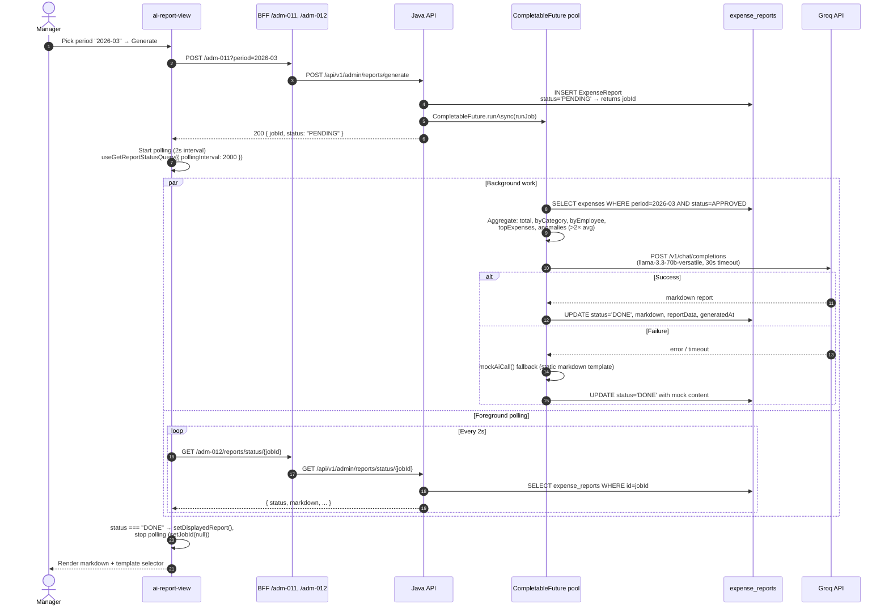
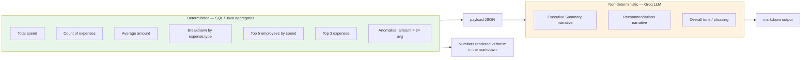

# AI Report — Manager async job

Async pattern for generating a monthly expense summary via Groq LLM. Split of "aggregate in SQL" vs "synthesize in LLM" is the interesting bit.

## Why not synchronous

Generating a report means: (1) run several SQL aggregates over a month of expense rows, (2) call an external LLM API with the aggregated payload, (3) parse and store the response. Steps 1 + 3 are fast; step 2 can take 10–30 seconds against Groq under load. Blocking the manager's browser for 30s for a click-and-wait UX is bad — but so is throwing this on a proper queue (RabbitMQ / Celery) for what's effectively a portfolio demo.

Solution: `CompletableFuture.runAsync()` — a background thread on the same JVM. Cheap, no infra, correct semantics (the HTTP response returns a `jobId` immediately, browser polls for status).

For 5+ concurrent reports per minute this would upgrade to a real job queue. For the "one manager clicks Generate once a month" pattern it's fine.

---

## 1. Sequence — click to result



---

## 2. Data model

```sql
-- db_fix.sql
CREATE TABLE expense_reports (
    id           BIGINT AUTO_INCREMENT PRIMARY KEY,
    period       VARCHAR(7)  NOT NULL,   -- "2026-03"
    status       ENUM('PENDING','DONE','FAILED') DEFAULT 'PENDING',
    report_data  JSON,                    -- aggregated payload (source of truth)
    markdown     LONGTEXT,                -- Groq response (or mock fallback)
    error_msg    VARCHAR(500),
    generated_at DATETIME,
    created_at   TIMESTAMP DEFAULT CURRENT_TIMESTAMP
);
```

**Why store `report_data` AND `markdown` both:**
- `report_data` = deterministic aggregates (total, breakdown, anomalies) — computed from SQL, reproducible, cachable, safe to re-render if the LLM output is bad.
- `markdown` = LLM narrative — non-deterministic, single-shot, best-effort.

If a reviewer complains about the LLM tone/style, we can regenerate the markdown without re-running the aggregation. Or if Groq is down for a long-running job, the `report_data` is still there to render manually.

**No expiry on rows.** Report history is intentionally permanent — cheap storage, useful for audit ("show me how we described March 2026 spend at the time").

---

## 3. Backend — the async kickoff

```java
// ExpenseReportController.java
@PostMapping("/generate")
public ResponseEntity<Map<String, Object>> generate(
        @RequestParam String period,
        HttpServletRequest request) {

    requireAdmin(request);                                  // permission check
    if (!period.matches("\\d{4}-\\d{2}")) {
        return badRequest(Map.of("error", "period must be yyyy-MM"));
    }

    Long jobId = reportService.createJob(period);                          // INSERT PENDING
    CompletableFuture.runAsync(() -> reportService.runJob(jobId, period)); // fire and forget

    return ok(Map.of("jobId", jobId, "status", "PENDING"));                // return immediately
}
```

The controller returns in <10ms. The heavy work happens in the ForkJoinPool default executor.

### The job itself

```java
// ExpenseReportService.runJob
public void runJob(Long jobId, String period) {
    try {
        String[] parts = period.split("-");
        int year  = Integer.parseInt(parts[0]);
        int month = Integer.parseInt(parts[1]);

        List<ExpenseEntity> expenses = expenseMapper.findApprovedByPeriod(year, month);
        Map<String, Object> payload = buildPayload(period, expenses);
        String reportDataJson = objectMapper.writeValueAsString(payload);

        String markdown = callAi(payload);                                 // Groq or mock fallback

        reportRepository.markDone(jobId, reportDataJson, markdown, LocalDateTime.now());
    } catch (Exception e) {
        reportRepository.markFailed(jobId, e.getMessage(), LocalDateTime.now());
    }
}
```

The `try/catch` around everything is important — a background thread's uncaught exception disappears silently. If the job blows up, `status = 'FAILED'` and `error_msg` gets the exception message so the manager can see what went wrong.

---

## 4. What gets computed vs synthesized

Sharp split between deterministic SQL work and non-deterministic LLM narrative:



**Rule:** LLM never sees raw expense rows, only the aggregated payload. LLM never invents numbers — the prompt hands it the numbers to describe. If the LLM adds a number that wasn't in the payload, that's a hallucination we can catch by cross-checking against `report_data`.

---

## 5. The Groq call

[`GroqClient.chatWithSystem`](../backend/src/main/java/com/example/my_java_app/client/GroqClient.java):

```java
Map<String, Object> requestBody = Map.of(
    "model",    model,        // llama-3.3-70b-versatile
    "messages", messages,     // [system?, user] JSON
    "stream",   false         // buffered response (not SSE)
);
HttpRequest request = HttpRequest.newBuilder()
    .uri(URI.create(baseUrl + "/v1/chat/completions"))
    .header("Authorization", "Bearer " + apiKey)
    .POST(HttpRequest.BodyPublishers.ofString(jsonBody))
    .timeout(Duration.ofSeconds(30))
    .build();
```

**Model:** `llama-3.3-70b-versatile` — Groq's largest general-purpose model, chosen for JSON-following consistency.
**Timeout:** 30s — Groq typically returns in 3–10s, 30s is a safety cap.
**No `max_tokens` / `temperature`** — Groq defaults (roughly ~4096 output tokens, 0.7 temperature). Deliberate: reports are short and we want consistent phrasing across periods.

### Prompt

```
You are a financial analyst assistant. Analyze the following expense report data
and write a concise financial summary in Markdown format.

Use these sections:
## Executive Summary
## Breakdown by Category
## Anomalies Detected
## Recommendations

Use **bold** for key numbers. Use bullet lists where appropriate.
Write in English. Be concise and professional.

Expense data (JSON):
{payload}
```

**Design notes on the prompt:**
- Named sections force a consistent structure — makes the markdown parseable/comparable across months.
- "Concise and professional" — reduces flowery language, common LLM failure mode for financial content.
- No output length target — length varies with data richness (a month with 50 anomalies has more to say than a quiet month).
- Bilingual note: hardcoded English. A production upgrade would parameterize on the manager's `language_code`.

### Fallback path

```java
try {
    return groqClient.chatWithSystem(SYSTEM_PROMPT, userPrompt);
} catch (Exception e) {
    log.warn("Groq call failed: {}", e.getMessage());
    return mockAiCall(payload);       // static markdown template
}
```

`mockAiCall` builds the same 4-section markdown structure using string templates over the payload. Result: report always ships, even if Groq is unreachable — the manager sees the same UI whether the LLM ran or not. Only difference is stylistic phrasing.

---

## 6. Polling from the frontend

```typescript
// components/admin/ai-report-view.tsx
const { data: statusData } = useGetReportStatusQuery(jobId!, {
  skip: jobId === null,
  pollingInterval: jobId !== null ? 2000 : 0,   // 2s while running, 0 (off) otherwise
});

useEffect(() => {
  if (!statusData) return;
  if (statusData.status === "DONE" || statusData.status === "FAILED") {
    setDisplayedReport(statusData);
    setJobId(null);                              // stop polling
  }
}, [statusData]);
```

**Why polling, not WebSocket:**
- One user, one report at a time — WebSocket overhead not justified.
- Groq typically finishes in <10s; the manager sees at most ~5 poll cycles.
- RTK Query has polling built-in — zero code beyond the interval param.

**Why 2 seconds:**
- <2s = wasteful (Groq rarely finishes that fast).
- >5s = feels laggy after the LLM completes.
- 2s is the sweet spot for typical Groq latency of 3–10s.

**No exponential back-off** — every poll is cheap (single indexed SELECT). Fixed interval is fine for this scale.

---

## 7. Report templates — separates rendering from generation

The template only affects PDF rendering. Markdown generation is template-agnostic.

```typescript
// components/admin/report-template-designer.tsx
const DEFAULT_SECTIONS: SectionItem[] = [
  { key: 'executiveSummary',    enabled: true },
  { key: 'breakdownByCategory', enabled: true },
  { key: 'byEmployee',          enabled: true },
  { key: 'anomalies',           enabled: true },
  { key: 'recommendations',     enabled: true },
  { key: 'aiAnalysis',          enabled: true },
];
```

Stored in `report_templates.config_json` as JSON. When the manager clicks "Download PDF" they pick a template; the backend renders the markdown with sections filtered by that template's toggles + branding (title, company, primary color, logo).

**Same report, multiple audiences:**
- Internal review template — all 6 sections
- CFO-facing template — Executive Summary + Anomalies only
- Public template — Executive Summary + Recommendations, no employee names

The `report_data` payload never changes. Only the projection changes.

---

## 8. Endpoints

| BFF path | HTTP | Java target | Purpose |
|---|---|---|---|
| `/adm-011/reports/generate?period=YYYY-MM` | POST | `POST /api/v1/admin/reports/generate` | Kick off async job, returns `jobId` |
| `/adm-012/reports/status/:jobId` | GET | `GET /api/v1/admin/reports/status/{jobId}` | Poll for status (PENDING/DONE/FAILED) |
| `/adm-013/reports/latest` | GET | `GET /api/v1/admin/reports/latest` | Get most recent DONE report (skip polling) |
| `/adm-014/report-templates` | GET/POST | `.../report-templates` | List + create templates |
| `/adm-015/report-templates/:id` | GET/PUT | `.../report-templates/{id}` | Get + update template |
| `/adm-016/report-templates/generate-pdf` | POST | (backend PDF rendering) | Combine template + report → PDF |
| `/mgr-005/reports/latest` | GET | Same as `/adm-013` | Manager-scoped read-only alias |

Both admins and managers can view. Only admins can generate (permission-gated by `EXPENSE_APPROVE`).

---

## 9. What's deliberately not built

- **Streaming markdown to the frontend.** Groq supports SSE streaming; we set `stream: false`. Reason: the frontend renders the entire markdown at once with syntax highlighting — partial markdown looks worse than a spinner.
- **Retry on Groq failure.** One try, then mock fallback. Retries would trigger duplicate charges on Groq and delay the response further.
- **Rate limiting.** Manager clicks Generate → job runs. If they click 10 times fast, 10 jobs run in parallel. Acceptable for the scale; would need a per-user cooldown for production.
- **Report scheduling.** No cron for auto-monthly reports. Manager clicks manually. Adding schedule would be trivial (`@Scheduled` in `ExpenseReportService`) but adds notification/email complexity.
- **Comparison with previous period.** LLM sees only one month's payload. "March spent 20% more than February" would need a wider payload.

Called out here so a reviewer sees the boundary, not gaps.

---

## Related

- [Architecture](/wiki/architecture) — where Groq fits in the request path
- [Expense lifecycle](/wiki/expense-lifecycle) — how expenses get into `APPROVED` state (the input to this report)
- [Auth flow](/wiki/auth-flow) — how the `EXPENSE_APPROVE` permission check works
