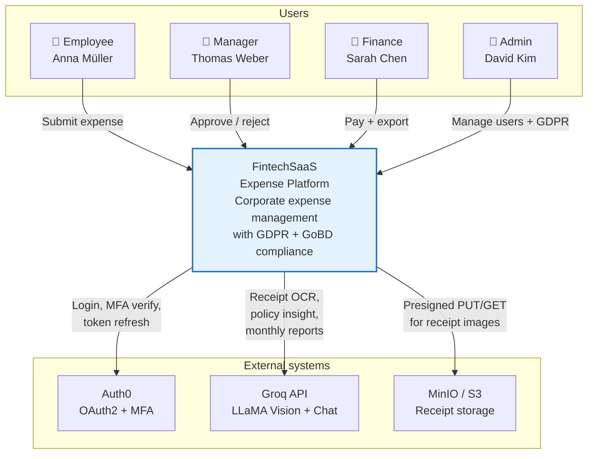
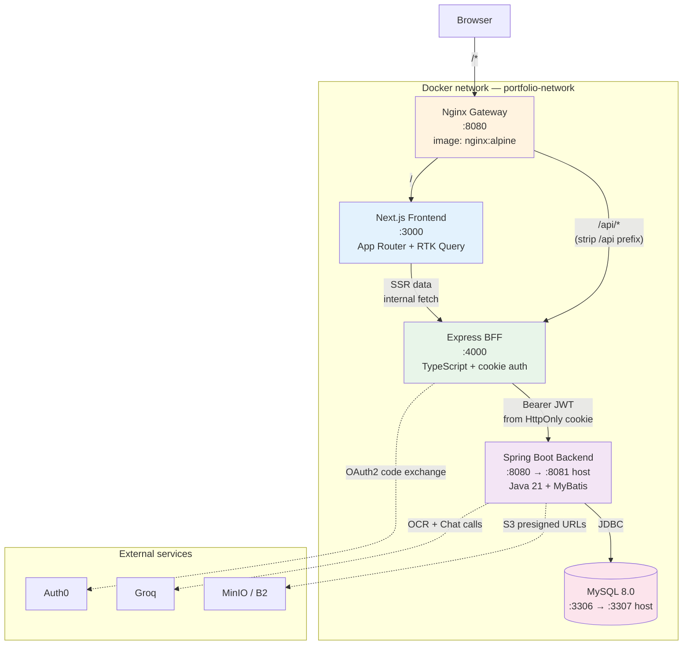
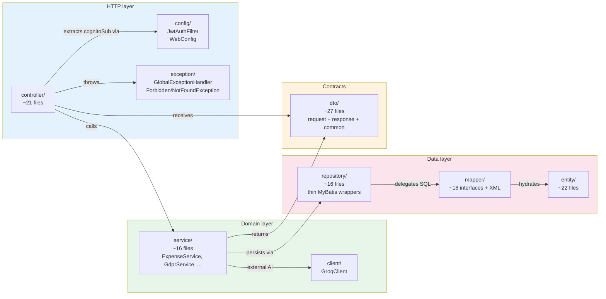

# System Architecture

Three-layer split (Frontend / BFF / Backend) with intentional token isolation, MyBatis-explicit SQL, and CMS-driven UI rules. Documented as a light C4 model: **Context** → **Container** → **Component**.

---

## C1 — Context

Who uses the system, and what external services it calls.



**Boundaries:**
- All login and MFA flows delegate to Auth0 — the system never stores passwords.
- Every AI feature routes through Groq — Groq is a hard dependency for OCR and insights, but every call has a mock fallback so demos work offline (see [ai-report](/wiki/ai-report)).
- Receipt binaries never touch the Java API — browsers upload directly to MinIO via presigned URLs.

---

## C2 — Container

Five Docker services, one Docker network (`portfolio-network`).



### Nginx routing rules

Configured in [`nginx/nginx.conf`](../nginx/nginx.conf):

```nginx
location / {
    proxy_pass http://react-frontend:3000;
}
location /api/ {
    rewrite ^/api/(.*) /$1 break;         # strip /api prefix before hitting BFF
    proxy_pass http://nextjs-bff:4000;
    proxy_buffer_size 128k;               # accommodate large Auth0 cookies
}
```

Two upstream paths, one public port. The frontend calls `/api/emp-001` (from the browser's perspective); Nginx strips `/api/` and forwards `/emp-001` to the BFF.

### Container responsibilities

| Container | Owns |
|---|---|
| **Frontend** | User-facing rendering, RTK Query cache, form state, client-side validation, Mermaid diagrams in wiki |
| **BFF** | HttpOnly cookie management, Auth0 token exchange, request shaping (e.g. `/emp-001?filename=x` → `/api/v1/expenses/upload-url?filename=x`), AI orchestration prompts |
| **Backend** | Domain logic, MyBatis queries, GDPR pseudonymization, retention timestamp computation, Groq client calls, presigned URL generation |
| **MySQL** | Persistent state — expenses, users, permissions, `policy_evaluation_history`, `gdpr_audit_log`, `screen_configs` |
| **Nginx Gateway** | Single public port, path-based routing, cookie proxy header limits |

---

## C3 — Component (backend focus)

The most interesting per-file structure lives in the Java backend. ~135 files across 9 packages:



### Package roles

| Package | Purpose | Notable classes |
|---|---|---|
| `controller/` | HTTP endpoints, one file per feature area | `AdminController`, `ExpenseController`, `GdprController`, `FinanceGdprController`, `UserPrivacyController` |
| `service/` | Business logic, transactional boundaries (`@Transactional`) | `ExpenseService`, `GdprService`, `DataExportService`, `ExpenseReportService`, `CsvImportService` |
| `repository/` | Thin wrapper over MyBatis mappers — clean method names | `ExpenseRepository.findByUserSub`, `GdprAuditLogRepository.hasLaterEvent` |
| `mapper/` | MyBatis interfaces + `resources/mapper/*.xml` with explicit SQL | `ExpenseMapper.xml`, `GdprMapper.xml`, `PolicyEvaluationHistoryMapper.xml` |
| `entity/` | Lombok `@Data` POJOs, 1:1 with DB tables | `ExpenseEntity`, `GdprAuditLogEntity`, `ScreenConfigEntity` |
| `dto/` | Request + response shapes exposed via HTTP | `CreateExpenseRequestDto`, `GdprErasureRequestDto`, `ScanResponseDto` |
| `config/` | Filters, MVC config, Spring beans | `JwtAuthFilter` (extract `cognitoSub`), `WebConfig` |
| `exception/` | Domain exceptions + `@ControllerAdvice` global handler | `ForbiddenException` → 403, `NotFoundException` → 404, generic → 500 |
| `client/` | External API clients | `GroqClient` (OCR + Chat) |

### Cross-cutting concerns present in code

- **[JwtAuthFilter](/wiki/auth-flow)** — decodes JWT, injects `cognitoSub` into request attributes for `/api/v1/**` routes only.

  > **Note on `cognitoSub` naming:** Auth0 issues a `sub` claim (`auth0|<hex24>`). The codebase stores and references this as `cognitoSub` — a legacy name from the initial AWS Cognito design. Same concept, different name.

- **`DataSourceAspect`** — `@Around` interceptor wrapping all `service..*` methods.
  Uses stack-walk + reflection to determine routing intent, then manages transaction
  lifecycle manually for write paths. Default is **WRITE** (safe for financial system).

  **Routing precedence (per stack frame, scanning outward):**
  ```
  @Write on method                  →  WRITE  (explicit, highest precedence)
  @Transactional(readOnly = true)   →  READ   (explicit opt-out)
  neither found on this frame       →  keep scanning outward
  nothing found anywhere in stack   →  WRITE  (safe default)
  ```

  > *"A write silently routed to the READ replica is a correctness bug (data loss /
  > replication lag), whereas a read routed to the WRITE pool is only a missed
  > optimization."* — Default WRITE is intentional for this financial system.

  **Why default WRITE matters in practice:** 7 write methods (`saveConsent`, `submit`,
  `approve`, `reject`, `updateProfile`, `saveProfile`, `applyPatch`) had no annotation —
  silently routing to READ. Changing the default fixed all 7 without touching those files.

  **Read-only opt-in:** 15 methods across 10 files explicitly marked
  `@Transactional(readOnly = true)` after agent audit (pure-SELECT only):
  `ExpenseService.listByUser/getById`, `FinanceService.listAll`, `ManagerService.getPending`,
  `PermissionService.getPermissionsForUser/hasPermission`, `ScreenConfigService.getActiveConfig`,
  `UserProfileService.getMyProfile/getMyProfileDetail`, `UserService.getAll/getById`, and others.
  Methods with no DB call (S3 presign, Groq HTTP) deliberately NOT marked — misleading otherwise.

  **Known limitation:** Stack-walk cannot distinguish overloaded methods (same name,
  different parameters) — `StackTraceElement` carries no parameter type info. If two
  methods share a name and one has `@Write`, both frames match. Acceptable in current
  codebase (no write/read overload pairs exist).

  > **Migration history:** Original default was READ. Root bug: `GdprService` (5 methods)
  > + `ExpenseService` (1 method) had `@Transactional` but no `@Write` → GDPR erasure
  > silently routed to READ. No data loss locally ("lucky" — both datasources same MySQL),
  > but would corrupt audit trail on a real replica. Fixed by: `@Write` on those 6 methods
  > + default changed to WRITE (covers 7 unannotated write methods without touching them).

  > **`SettlementService.handleCreateSettlement`** has `@Write` but agent audit found no
  > write DB calls — only `findById` + in-memory logic. May be mid-refactor or missing
  > persist. Flagged, not yet fixed.

- **`@Transactional`** — declarative annotation on mutating service methods. Now serves dual purpose: Spring transaction management AND datasource routing signal for `DataSourceAspect`. `readOnly = true` on read-only service methods makes routing explicit and enables query optimizations on the replica.

- **CORS** — not enforced by Spring; handled at Nginx via header forwarding since the frontend is same-origin behind the gateway.

---

## Key architectural decisions

Each of these is a design choice worth defending in interview:

1. **BFF as auth boundary** — tokens live in HttpOnly cookies + BFF memory only. Never in JS. See [auth-flow](/wiki/auth-flow).
2. **MyBatis over JPA** — GDPR pseudonymization queries are explicit UPDATE statements with no FK. JPA cascade behavior would be a liability here.
3. **Direct-to-storage uploads** — presigned PUT URLs (15 min TTL). Java server never streams file bytes; memory footprint is fixed regardless of receipt size.
4. **CMS-driven compliance rules** — evaluation logic lives in `screen_configs` JSON, not Java. Snapshot captured at expense create time is immutable (see [CMS policy rules](/wiki/cms-policy-rules)).
5. **Async AI jobs** — `CompletableFuture.runAsync()` for reports; polling from frontend at 2s intervals. No queue infrastructure needed at demo scale (see [AI report](/wiki/ai-report)).
6. **`retention_expires_at` in SQL, not Java** — computed via `DATE_ADD(CURDATE(), INTERVAL 10 YEAR)` in the same UPDATE that sets `paid_at`. Eliminates clock drift; no backfill migration ever needed.
7. **AOP-driven read/write routing via `@Transactional(readOnly)`** — `DataSourceAspect`
   intercepts all service calls and routes to write or read datasource by reading
   `@Transactional(readOnly)` directly from the joinpoint — no custom annotation needed.
   `@Order(Ordered.HIGHEST_PRECEDENCE)` ensures the aspect sets the datasource key
   **before** Spring's `@Transactional` proxy opens the connection. Aspect owns only
   datasource routing; Spring owns transaction lifecycle. Clean separation of concerns.
   `DataSourceConfig` wires two HikariCP pools behind `AbstractRoutingDataSource`;
   `DataSourceContextHolder` (ThreadLocal) carries the routing key per request.

---

## Related

- [Auth flow](/wiki/auth-flow) — how tokens flow through the BFF
- [Expense lifecycle](/wiki/expense-lifecycle) — the domain state machine that all controllers converge on
- [Admin & management](/wiki/admin-management) — how the permission model is administered
- [CMS policy rules](/wiki/cms-policy-rules) — the `screen_configs` versioning strategy