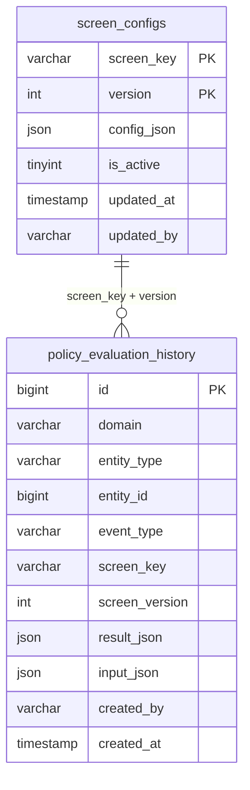
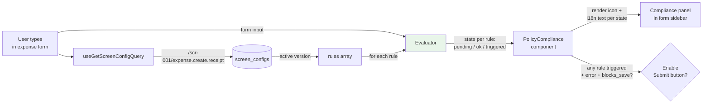
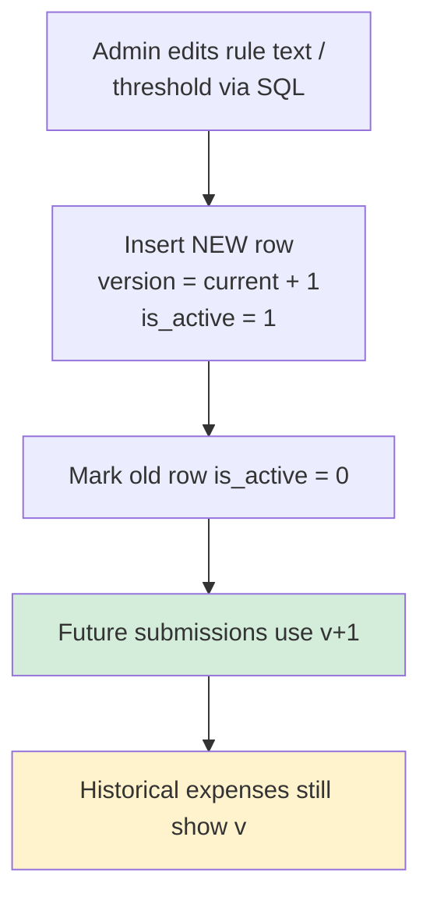

# CMS-Driven Policy Rules

Compliance rules live in the database as versioned JSON, not in code. Every rule evaluation at expense-create time is captured as an **immutable snapshot** — critical for audit.

## Why not hardcode

The naive approach: `if (expense.currency !== 'EUR') { showError() }`. Ships fine for the first month. Then:

- Legal changes the wording of "currency mismatch" for DSGVO clarity → code change → deploy.
- The rate for German mileage bumps from €0.30 to €0.35 (2026 update) → hunt through 4 view components → update, test, deploy.
- Auditor asks "what did the compliance panel say to Anna when she submitted her March 3rd expense?" → git log archaeology, hope the display text didn't change.

CMS-driven rules solve all three:
- Compliance text edits = SQL update, no deploy.
- Numeric thresholds = ENV/config, easy to change.
- Snapshots = the exact rule set + resolved text a user saw is frozen at submission time.

---

## 1. Data model



### `screen_configs` — the CMS

```sql
CREATE TABLE screen_configs (
    screen_key   VARCHAR(100) NOT NULL,
    version      INT NOT NULL DEFAULT 1,
    config_json  JSON NOT NULL,
    is_active    TINYINT(1) DEFAULT 1,
    updated_at   TIMESTAMP DEFAULT CURRENT_TIMESTAMP ON UPDATE CURRENT_TIMESTAMP,
    updated_by   VARCHAR(36),
    PRIMARY KEY (screen_key, version)
);
```

**Composite primary key** on `(screen_key, version)` — multiple versions of the same screen coexist. Only one is `is_active=1` at any time; older versions stay in the table for historical snapshot reference.

**4 screen keys seeded:**
- `expense.create.receipt`
- `expense.create.per_diem`
- `expense.create.mileage`
- `manager.approvals.detail`

### `policy_evaluation_history` — the immutable snapshot

Written once per expense create. Never updated (only `is_deleted` flip during GDPR nullification). Documented in detail in [expense-lifecycle §4](/wiki/expense-lifecycle).

---

## 2. Rule structure — anatomy of one rule

Every rule in a screen config's `compliance` array follows this schema. Example from `expense.create.receipt`:

```json
{
  "id": "currency_mismatch",
  "icon": "currency_exchange",
  "title_key":          "expense.policy.receipt.currency_mismatch.title",
  "pending_desc_key":   "expense.policy.receipt.currency_mismatch.pending",
  "ok_desc_key":        "expense.policy.receipt.currency_mismatch.ok",
  "triggered_desc_key": "expense.policy.receipt.currency_mismatch.triggered",
  "severity":    "error",
  "blocks_save": true,
  "condition":   "currency_mismatch"
}
```

| Field | Purpose |
|---|---|
| `id` | Unique within the screen — used as React key + snapshot lookup |
| `icon` | Material Design icon name — rendered next to the rule |
| `title_key` | i18n key for the rule's short label |
| `pending_desc_key` | Description shown when the rule hasn't been evaluated yet (empty form) |
| `ok_desc_key` | Description when input passes the rule |
| `triggered_desc_key` | Description when input fails the rule |
| `severity` | `error` \| `warning` \| `info` \| `success` — drives icon color + block-save behavior |
| `blocks_save` | If `true` AND `severity === 'error'` AND state = triggered → disable Submit button |
| `condition` | Identifier the frontend evaluator maps to a function (e.g. `currency_mismatch` → `input.currency !== 'EUR'`) |

### Severity ≠ blocks_save

Deliberately decoupled:
- `severity: error, blocks_save: true` — hard fail, cannot submit
- `severity: error, blocks_save: false` — visual warning is strong (red), but user can still submit (e.g. "amount > €500 typically requires a receipt, please attach one")
- `severity: warning` — informational only
- `severity: info` — neutral note (e.g. "VAT rate detected: 19%")
- `severity: success` — positive confirmation (e.g. "Receipt image attached ✓")

This separation lets the compliance team roll out new rules in "warn mode" first (visible but non-blocking), then flip `blocks_save` after users adapt.

---

## 3. Evaluation flow — frontend



### Consuming the CMS query

```typescript
// components/expenses/scan-view.tsx (RECEIPT form)
const { data: config } = useGetScreenConfigQuery("expense.create.receipt");
```

Same pattern for `per-diem-view.tsx` and `mileage-view.tsx`, each with their screen key. RTK Query caches per key — one config load per session, invalidated only if a component explicitly refetches.

### Rule evaluator

For each rule in the config, the view code has a mapping from `condition` string to a JavaScript predicate:

```typescript
// example — per-diem-view.tsx (paraphrased)
function evaluate(rule, input) {
  switch (rule.condition) {
    case "location_selected":
      return input.countryCode ? "ok" : "pending";
    case "duration_valid":
      return input.days > 0 ? "ok" : "pending";
    case "meal_deduction_required":
      return input.days > 3 ? "triggered" : "ok";
    case "proration":
      return input.days === 1 ? "triggered" : "ok";
    default:
      return "pending";
  }
}
```

State is one of `"pending" | "ok" | "triggered"`. Frontend maps that to the correct i18n key from the rule (`pending_desc_key` / `ok_desc_key` / `triggered_desc_key`).

### PolicyCompliance component

[`components/expenses/policy-compliance.tsx`](../frontend/components/expenses/policy-compliance.tsx) takes the rule array + evaluation results and renders:

- Icon per rule (from `rule.icon`, colored by `rule.severity + state`)
- Title text (`t(rule.title_key)`)
- Description text (based on state → correct `*_desc_key`)
- Overall submit-disabled logic: if any rule has `state === "triggered" && severity === "error" && blocks_save === true`

---

## 4. Snapshot immutability — why versioning matters

The critical property: **once an expense is submitted, the compliance evaluation it saw is frozen**. Auditor looking at expense #123 six months later sees exactly what Anna saw when she clicked Submit, regardless of what CMS edits happened in between.

### How `screen_version` gets frozen

At create time, [`ExpenseService.savePolicySnapshotIfPresent`](../backend/src/main/java/com/example/my_java_app/service/ExpenseService.java) reads the active version and freezes it into the snapshot row:

```java
Integer screenVersion = screenConfigRepository.findActive(snapshot.getScreenKey())
        .map(ScreenConfigEntity::getVersion)
        .orElse(null);   // ← captured HERE

PolicyEvaluationHistoryEntity history = new PolicyEvaluationHistoryEntity();
history.setScreenKey(snapshot.getScreenKey());
history.setScreenVersion(screenVersion);   // ← frozen in the row
history.setResultJson(objectMapper.writeValueAsString(snapshot.getItems()));
history.setInputJson(objectMapper.writeValueAsString(snapshot.getInputSnapshot()));
```

### What's in `result_json`

A JSON array of `PolicyEvaluationItemDto`, one entry per rule that was evaluated:

```json
[
  {
    "id": "currency_mismatch",
    "severity": "error",
    "state": "ok",
    "resolvedTitle": "Currency check",
    "resolvedDesc": "Amount is in EUR — matches company base currency.",
    "titleKey": "expense.policy.receipt.currency_mismatch.title",
    "okDescKey": "expense.policy.receipt.currency_mismatch.ok"
  },
  {
    "id": "vat_accuracy",
    "severity": "warning",
    "state": "triggered",
    "resolvedTitle": "VAT rate check",
    "resolvedDesc": "Extracted VAT rate 7% differs from expected 19% — verify receipt.",
    ...
  }
]
```

**Note the two forms of every text field:**
- `titleKey` / `okDescKey` — i18n keys (frontend can re-resolve if translation file changes)
- `resolvedTitle` / `resolvedDesc` — actual rendered text at the moment of submission

Storing both is deliberate:
- **`resolvedText`** is the ground truth — what the user literally saw on screen.
- **`titleKey`** allows re-resolution if the user views the historical snapshot in a different language later.

### What's in `input_json`

The exact form field values at submission — used to reproduce evaluation without touching the current CMS rules:

```json
{
  "vendor": "REWE GmbH",
  "receiptDate": "2026-05-15",
  "amount": 47.80,
  "vatAmount": 7.63,
  "vatRate": "19%",
  "category": "Meals & Entertainment"
}
```

Enables answering "given the form input at time T and the CMS rules at time T, what did the panel say?" — full replay from row #123 alone, no need to reconstruct historical DB state.

---

## 5. Detail view — how the snapshot is read back

When a user (or admin) opens `/my-expenses/[id]`, the backend fetches the snapshot with:

```sql
SELECT * FROM policy_evaluation_history
WHERE entity_type = 'EXPENSE'
  AND entity_id   = #{expenseId}
  AND event_type  = 'CREATE'
ORDER BY created_at DESC, id DESC
LIMIT 1
```

The detail view then renders the `result_json` items using the SAME `PolicyCompliance` component as the form — but in read-only mode. The historical text is rendered directly from `resolvedDesc`, not re-evaluated.

If CMS rules were edited after the snapshot was written, the detail view still shows the original evaluation. New rules that were added later do NOT appear on old expenses.

This is what "immutable" means in practice.

---

## 6. Versioning workflow (not implemented in UI, documented for design intent)

The schema supports full rule versioning, but there's currently no admin UI to edit rules — edits happen via direct SQL for now. Intended workflow when a rule needs updating:



Steps in SQL:

```sql
-- 1. Get current active version
SELECT version FROM screen_configs
WHERE screen_key = 'expense.create.receipt' AND is_active = 1;   -- e.g. returns 3

-- 2. Insert new version, keep old
INSERT INTO screen_configs (screen_key, version, config_json, is_active)
VALUES ('expense.create.receipt', 4, '<new json>', 1);

-- 3. Deactivate old
UPDATE screen_configs
SET is_active = 0
WHERE screen_key = 'expense.create.receipt' AND version = 3;
```

The current `findActive()` query returns `LIMIT 1` — so only one active row per screen at any time. All historical versions remain queryable by `(screen_key, version)`.

**Not implemented:**
- Admin UI for rule editing
- Rollback (would just be an UPDATE flipping `is_active` back)
- Diff view between versions
- Draft/publish workflow

These are all straightforward additions on the existing schema — noted for reviewers who ask "how would you productionize this".

---

## 7. Endpoint

Only one endpoint needed — everything else is snapshot read (via expense detail):

| BFF path | HTTP | Java target | Purpose |
|---|---|---|---|
| `/scr-001/:screen_key` | GET | `GET /api/v1/screen-configs/{screenKey}` | Returns active version's `config_json` for the given key |

Cache-friendly: the response is stable until the admin publishes a new version, which is rare. Frontend RTK Query caches per screen key.

---

## Related

- [Expense lifecycle §4](/wiki/expense-lifecycle) — the snapshot storage mechanics
- [Architecture](/wiki/architecture) — where `ScreenConfigRepository` sits in the layer diagram
- [Admin & management](/wiki/admin-management) — where rule-editing UI would live if built
