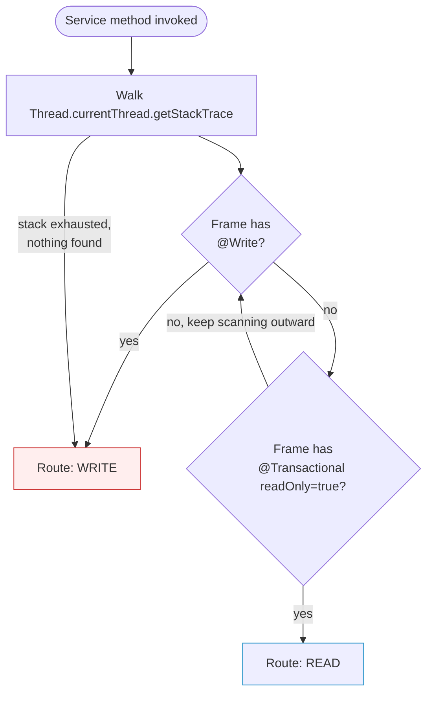
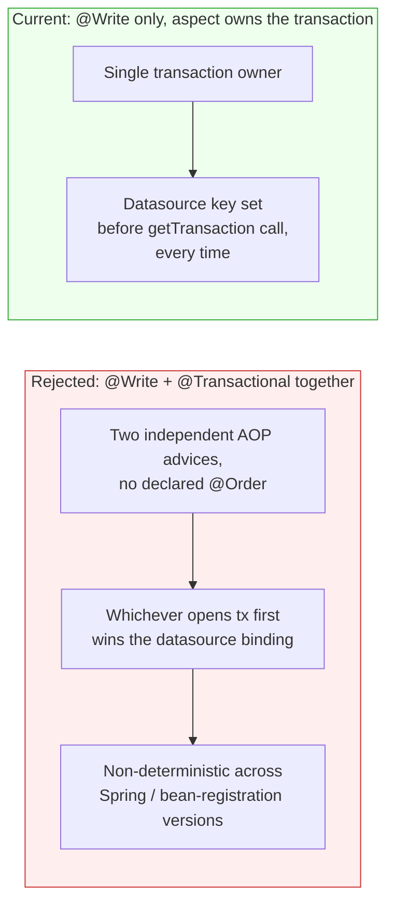
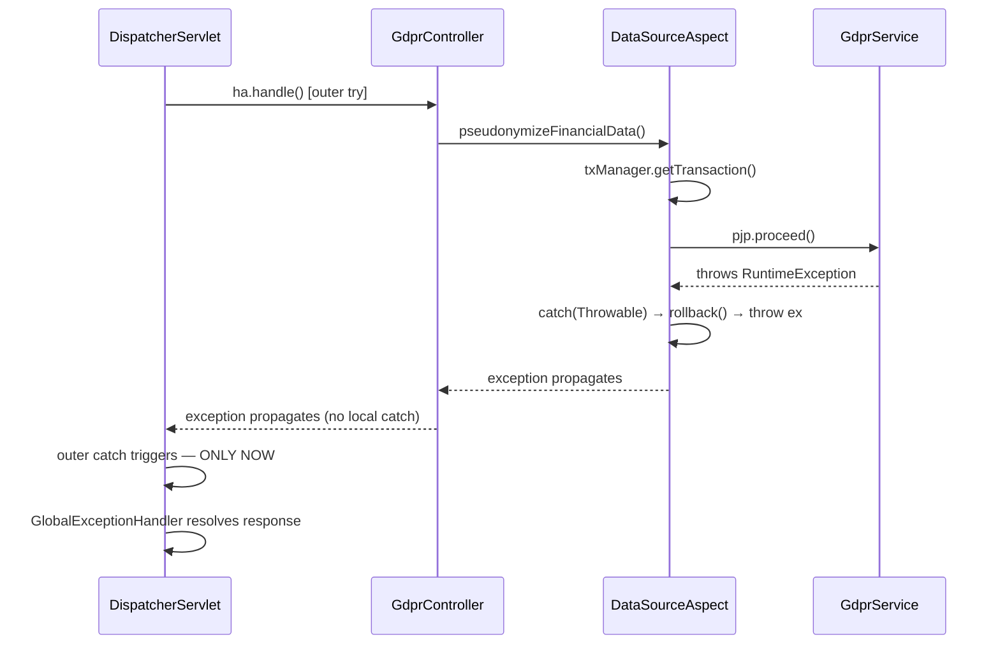

# Read/Write Datasource Routing

How the backend splits queries between a WRITE and a READ MySQL pool, how the routing decision is detected, and why the failure mode is designed to fail toward correctness rather than performance. Written as a review note after a debugging pass surfaced (and fixed) a real routing bug in the GDPR erasure path.

---

## 1. Why this exists

`DataSourceConfig` wires two connection pools behind one `AbstractRoutingDataSource`:

```java
// DataSourceConfig.java
routing.setTargetDataSources(Map.of("WRITE", write, "READ", read));
routing.setDefaultTargetDataSource(read);
```

Every JDBC connection request resolves through `RoutingDataSource.determineCurrentLookupKey()`, which reads a thread-local key (`DataSourceContextHolder`). Something has to set that key correctly **before** any query for the current request opens a connection — that's the job of `DataSourceAspect`.

---

## 2. How the routing decision is made

`DataSourceAspect` is an `@Around` advice matching every method in `com.example.my_java_app.service..*`. Before the target method runs, it decides WRITE or READ and sets the context key.



**Detection is stack-walk-based, not signature-based.** `isWriteCall()` calls `Thread.currentThread().getStackTrace()` and, for each frame under `com.example`, uses reflection (`Class.forName` + `getDeclaredMethods()`) to find the method being invoked and check its annotations. This is a deliberate but unusual choice — the standard Spring AOP way would be to read `((MethodSignature) pjp.getSignature()).getMethod()` directly. The stack-walk exists so the check isn't limited to the exact method the aspect is currently intercepting; in practice, since the pointcut already matches every service method, the outermost matching frame is normally the one that matters.

**Per-frame precedence**, scanning outward from the innermost `com.example` frame:

1. `@Write` on the method → **WRITE**
2. `@Transactional(readOnly = true)` → **READ**
3. Neither found on this frame → keep scanning outward
4. Nothing found anywhere in the stack → **WRITE** (see §3)

---

## 3. Why the default is WRITE, not READ

This was changed deliberately, and is the single most important safety property of this design.

| Misrouted direction | Consequence |
|---|---|
| Read method → routed WRITE | Wasted capacity on the write pool. No data-integrity impact. |
| **Write method → routed READ** | INSERT/UPDATE/DELETE silently targets the wrong connection pool. No exception. No log signal by default. Data may be lost, delayed by replication lag, or simply never reach the primary. |

The failure modes are not symmetric, so the default cannot be neutral. For a system whose write paths include GDPR erasure (compliance-mandated, time-boxed under DSGVO Art. 12) and financial state transitions (`markPaid`, `pseudonymizeFinancialData`), a silently-dropped-or-delayed write is a materially worse outcome than a wasted read-pool connection. The system is therefore fail-safe by default: **an unannotated method is assumed to write** until it explicitly opts into `@Transactional(readOnly = true)`.

This directly fixed a real bug: prior to this change, 6+ methods with real `repository.save/update/delete` calls (`GdprService.recordErasureRequest`, `pseudonymizeFinancialData`, `hardDeletePersonalData`, `confirmFinanceGobd`, `recordDataExport`, `ExpenseService.create`, plus `OnboardingService`, `ManagerService`, `UserProfileService`, `ScreenConfigService` write methods) had neither `@Write` nor `@Transactional` — under the old READ-default, every one of them was silently routed to the read pool. Flipping the default closed this entire class of bug in one change, without having to hunt down and annotate every write method individually.

15 genuinely read-only methods across 10 service files were then explicitly annotated with `@Transactional(readOnly = true)` to opt back into READ routing — verified one at a time by tracing each method's repository calls, not assumed from the method name.

---

## 4. Transaction management is manual, not delegated to Spring

For methods that route WRITE, the aspect does not rely on Spring's own `@Transactional` proxy — it opens, commits, and rolls back the transaction itself:

```java
// DataSourceAspect.routeAndTx() — WRITE branch
DataSourceContextHolder.set("WRITE");
TransactionStatus status = txManager.getTransaction(def);
try {
    Object result = pjp.proceed();
    if (status.isRollbackOnly()) txManager.rollback(status);
    else                          txManager.commit(status);
    return result;
} catch (Throwable ex) {
    txManager.rollback(status);
    throw ex;
} finally {
    DataSourceContextHolder.clear();
}
```

**Why not just use `@Transactional` and let Spring do this?** Because Spring's transaction interceptor and this custom aspect are two independent AOP advices that can both wrap the same method. If a method carried both `@Write` and `@Transactional`, there would be no guaranteed ordering between them (neither declares `@Order`, so both default to the same precedence bucket) — whichever one happens to open the transaction first determines which physical datasource gets bound for the *entire* transaction, since `AbstractRoutingDataSource` only resolves its lookup key once, at connection-acquisition time, not on every query.

This was caught and fixed directly: the 6 methods above had been given `@Write` *and* `@Transactional` simultaneously (a mistake from an earlier iteration of this same fix). `@Transactional` was removed from all of them — the aspect's manual transaction handling is complete on its own, and duplicating it via Spring's annotation only reintroduced the ordering hazard it was meant to close.



---

## 5. Exception safety — rollback is guaranteed, not racing `GlobalExceptionHandler`

A natural question when reading `catch (Throwable ex) { rollback(); throw ex; }`: could `@ControllerAdvice`/`GlobalExceptionHandler` intercept the exception first and prevent the rollback from running?

No — and this is a structural guarantee, not a configuration choice that could be broken by a future change. `GlobalExceptionHandler` is not an AOP interceptor wrapping the service call; it is invoked by `DispatcherServlet` via `ExceptionHandlerExceptionResolver`, in a try-catch that wraps the **entire controller method invocation** (`ha.handle(...)`). That try-catch is structurally outside everything that happens inside the controller method — including every service call and everything `DataSourceAspect` does around it.



Because `pjp.proceed()` is a synchronous Java call, an exception thrown by `GdprService` cannot skip over the aspect's `catch` block on its way out — Java's call stack unwinding has no mechanism for an outer handler to intercept before an inner one. This is unlike the `@Write`/`@Transactional` hazard in §4, which was a real risk because both were AOP advices at the *same* layer with undefined relative order. `GlobalExceptionHandler` operates one full layer higher (the servlet dispatch boundary), so there is no ordering configuration that could invert this — confirmed by tracing the actual call sites (`GdprController.processErasure()` has no local try/catch, `GdprService.pseudonymizeFinancialData()` has no internal try/catch either) rather than assumed from framework docs alone.

---

## 6. Known trade-offs (not fixed — documented as accepted)

- **Stack-walk cost.** `isWriteCall()` runs `Thread.getStackTrace()` + `Class.forName()` + reflective method lookup on every service call. Slower than reading `pjp.getSignature()` directly. Left as-is; not a correctness issue, only a minor throughput one.
- **Name-based frame matching.** The stack walk matches by `element.getMethodName()` string equality, not by exact `Method` identity. Two same-named methods in the same class (overloads) could theoretically resolve to the wrong one. No overloaded service methods currently exist in this codebase, so this has not manifested as a bug, but it is a latent sharp edge if that changes.
- **Single MySQL replica, not a cluster.** The WRITE/READ split currently points at the same physical database in local/demo config (`application.yml`) — the routing logic is real and tested, but there is no live replica behind it yet. Scaling to N read replicas (e.g. via ProxySQL or a cloud reader endpoint) requires no changes to `DataSourceAspect` at all — only the `read` datasource URL needs to point at a load-balancing proxy instead of a single instance.

---

## Related

- [Architecture](./architecture.md) — where the Spring Boot API sits in the overall system
- [GDPR / DSGVO](./gdpr-compliance.md) — the erasure workflow whose write path motivated this review
