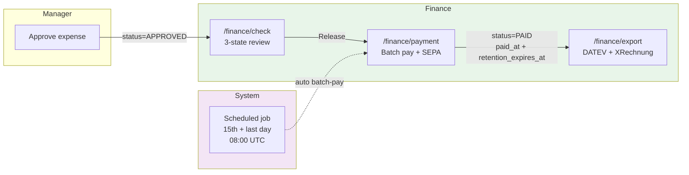
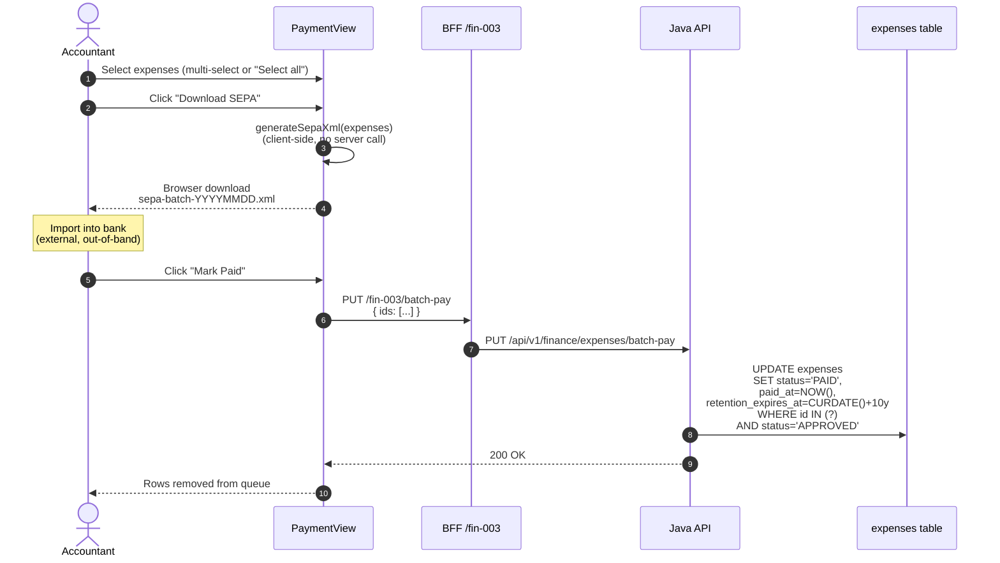

# Finance Workflows

End-to-end operations the FINANCE role performs after Manager approval. Three screens, one scheduled job.

## Why this exists as its own doc

Manager approves an expense → it sits in `APPROVED` state. Everything from there — release for payment, generate SEPA file, mark PAID, export to accounting, kick off the 10-year GoBD retention clock — is Finance territory with distinct compliance obligations. This doc traces the workflow end-to-end.

---

## 1. Big-picture flow



---

## 2. `/finance/check` — 3-state accountant review

The intermediate step between manager approval and payment. Separation of duties: the manager confirms business justification; the accountant confirms it's payable.

### UI states (local React state, not persisted)

- **Pending check** — APPROVED expenses waiting for accountant review
- **Released for payment** — accountant OK'd, ready for batch payment
- **Flagged** — needs further investigation before payment

```typescript
// components/finance/check-view.tsx
const [released, setReleased] = useState<Set<number>>(new Set());
const [flagged, setFlagged] = useState<Set<number>>(new Set());

const handleRelease = (id: number) => {
  setReleased((prev) => new Set(prev).add(id));
  setFlagged((prev) => { const next = new Set(prev); next.delete(id); return next; });
};
```

### Why local state (deliberate design choice)

The check state is deliberately **not persisted** yet. Reasons:
1. **Reversibility.** Accountant can toggle Release ↔ Flag repeatedly during a single review session without polluting audit history.
2. **Simplicity.** No new table, no new state machine — the underlying `expenses.status` stays `APPROVED` until actual payment.
3. **Auditability comes from `paid_at`.** Once released → paid → `paid_at` is written; that's the audit event that matters.

For a real production deployment where multiple accountants review together, this would upgrade to a persisted `expenses.check_state` column with `PENDING_CHECK / RELEASED / FLAGGED / PAID` values — but for a single-accountant workflow, local state avoids over-engineering.

### Retention badge in the same view

Also on this screen: the [retention badge](/wiki/gdpr-compliance) that reads `retention_expires_at` — Finance can spot expenses about to age out of the GoBD 10-year window without leaving the workflow.

---

## 3. `/finance/payment` — batch pay + SEPA XML generation

### Payment flow



### SEPA XML generation — client-side

SEPA is built in the browser, not the server. This keeps the Java API stateless w.r.t. file generation and makes iterating on the XML format zero-deploy.

Format: **pain.001.001.03** (ISO 20022 SEPA Credit Transfer Initiation). Structure:

```xml
<Document xmlns="urn:iso:std:iso:20022:tech:xsd:pain.001.001.03">
  <CstmrCdtTrfInitn>
    <GrpHdr>
      <MsgId>MSG-20260605-1430</MsgId>
      <CreDtTm>2026-06-05T14:30:00</CreDtTm>
      <NbOfTxs>{n}</NbOfTxs>
      <CtrlSum>{sum of all amounts}</CtrlSum>
      <InitgPty><Nm>FintechSaaS GmbH</Nm></InitgPty>
    </GrpHdr>
    <PmtInf>
      <!-- one <CdtTrfTxInf> per expense -->
      <CdtTrfTxInf>
        <PmtId><EndToEndId>EXP-{id}-001</EndToEndId></PmtId>
        <Amt><InstdAmt Ccy="EUR">{amount}</InstdAmt></Amt>
        <Cdtr><Nm>{title or vendor}</Nm></Cdtr>
        <CdtrAcct><Id><IBAN>DE89370400440532013000</IBAN></Id></CdtrAcct>
        <RmtInf><Ustrd>Expense reimbursement {id} — {date}</Ustrd></RmtInf>
      </CdtTrfTxInf>
    </PmtInf>
  </CstmrCdtTrfInitn>
</Document>
```

**Key computed fields:**
- `MsgId` — `MSG-YYYYMMDD-HHmm` (per-batch unique)
- `NbOfTxs` — count of transactions in the batch
- `CtrlSum` — sum of all `InstdAmt`, formatted `%.2f`
- `EndToEndId` — `EXP-{expense.id}-{index}` for reconciliation
- Character escaping — special chars `<>&'"` stripped from vendor names to prevent XML injection

**IBAN handling** (TODO — currently hardcoded to demo value `DE89370400440532013000`). Production version reads from a per-employee bank account entity linked to `user_profiles`.

### Why "download first, mark paid second"

The button sequence is intentional:

1. **Download SEPA** first — no DB change, safe to click multiple times
2. **User imports into bank** (SFTP / manual upload / EBICS — out of our system)
3. **Confirm paid** in our system → THEN write `paid_at`

This decouples file generation from state transition. If the bank import fails or the accountant needs to re-download the file, no expenses have been prematurely marked PAID. The `paid_at` is only written after the accountant clicks "Mark Paid".

---

## 4. `markPaid` / `markBatchPaid` — the atomic SQL

Both go through the same idempotent update pattern. From [`ExpenseMapper.xml`](../backend/src/main/resources/mapper/ExpenseMapper.xml):

```xml
<update id="markBatchPaid">
    UPDATE expenses
    SET status               = 'PAID',
        paid_at              = NOW(),
        retention_expires_at = DATE_ADD(CURDATE(), INTERVAL 10 YEAR)
    WHERE id IN
    <foreach item="id" collection="ids" open="(" separator="," close=")">
        #{id}
    </foreach>
      AND status = 'APPROVED'
</update>
```

### Three design details worth calling out

1. **`AND status = 'APPROVED'` in the WHERE clause.** If a caller (bug, race, replay attack) tries to batch-pay an expense already `PAID` or `REJECTED`, the WHERE simply matches 0 rows — no error, no double-payment. Idempotency at the SQL layer, not the app layer.
2. **`NOW()` and `CURDATE()` are evaluated once per statement in MySQL.** Every row in a batch gets the *same* `paid_at` timestamp, which makes reconciliation with the SEPA batch trivial (one file, one timestamp).
3. **`retention_expires_at = DATE_ADD(CURDATE(), INTERVAL 10 YEAR)`.** Computed in SQL — not Java. Eliminates JVM/DB clock skew and removes any need for a backfill migration. The GoBD §14 10-year retention window starts at the moment of payment, not creation.

---

## 5. Scheduled auto batch-pay

For companies that don't have a dedicated Finance person on payment days, `FinanceService` includes a cron job:

```java
// FinanceService.java
@Scheduled(cron = "0 0 8 * * ?")   // every day at 08:00 UTC
public void scheduledBatchPay() {
    int day = LocalDateTime.now().getDayOfMonth();
    int lastDay = LocalDateTime.now().toLocalDate().lengthOfMonth();
    if (day != 15 && day != lastDay) return;   // only fire on 15th + last day

    List<ExpenseEntity> approved = expenseMapper.findAllApproved();
    if (approved.isEmpty()) return;

    List<Long> ids = approved.stream().map(ExpenseEntity::getId).collect(toList());
    expenseMapper.markBatchPaid(ids);
    log.info("[ScheduledBatchPay] Auto-paid {} expense(s) on day {}", ids.size(), day);
}
```

### Design notes

- **Runs daily, filters inside** — Spring's `@Scheduled` cron doesn't natively support "15th OR last day of month" so the filter runs in Java. Cheap (`ZonedDateTime.getDayOfMonth()` is O(1)).
- **08:00 UTC** — chosen so the payment cycle completes before EU banking hours (09:00 CET/CEST = 07:00/08:00 UTC).
- **No SEPA XML generated for the scheduled job.** The job just flips `status → PAID`. In production this would need to also generate + submit the SEPA file to the bank, but that's not in scope for the portfolio demo (would need bank EBICS integration).
- **Idempotent by the same SQL guard.** If a manual Finance user has already batch-paid some expenses that day, the cron job's `findAllApproved()` returns the remaining `APPROVED` rows only.

---

## 6. `/finance/export` — DATEV CSV + XRechnung

Once expenses are `PAID`, they need to flow into the company's accounting system.

### Client-side format generation, filtered by period

Same pattern as SEPA — all format generation happens in-browser. `filterByPeriod()` narrows the expense list to the selected window before serialization.

```typescript
type Period = "current_month" | "last_month" | "current_quarter" | "all";
```

### DATEV CSV

DATEV imports **Reisekostenabrechnung** entries via a semicolon-delimited CSV. Column mapping:

| Column | Value | Notes |
|---|---|---|
| Umsatz | `47,80` | Amount, decimal COMMA (German locale), 2 decimals |
| Soll/Haben | `S` | Always debit for expense |
| WKZ | `EUR` | Currency |
| Konto | `6300` / `6310` / `6320` | RECEIPT / PER_DIEM / MILEAGE respectively — SKR03 expense accounts |
| Gegenkonto | `1600` | Kasse (petty cash) offset |
| Belegdatum | `20260415` | Date, YYYYMMDD (no separators) |
| Belegfeld1 | `EXP123` | Our internal expense ID prefixed |
| Buchungstext | `DB Bahn ticket` | Title/vendor, semicolons stripped |
| Kostenstelle | `REISE` | Fixed cost center |
| Steuercode | `VST` | Vorsteuerabzug — input tax deduction |

The Konto mapping (`6300/6310/6320`) is derived from `expense.type` at export time — the DB stores the semantic type, the export encodes it as an SKR03 account number.

### XRechnung

For invoice-style reimbursement claims (e.g. contractor per-diems), the same expense list is serialized as **UBL 2.1 XML compliant with XRechnung 2.0 / EN16931**. Structure:

- `<cbc:CustomizationID>` — declares XRechnung 2.0 compliance
- `<cbc:ProfileID>` — PEPPOL BIS Billing 3.0 profile
- One `<cac:InvoiceLine>` per expense with 19% VAT category `S` (standard German VAT rate)
- `<cac:LegalMonetaryTotal>` — computed net + VAT + gross totals

The frontend does not currently include a **Leitweg-ID** (required for B2G invoicing) or ZUGFeRD hybrid PDF — these are documented as TODO for production readiness in the [tax-export doc](/wiki/tax-export).

### SEPA is not exposed on this screen

The Export view offers DATEV + XRechnung only. SEPA is on the Payment view because it's tied to the payment moment. Rationale: an export screen typically produces *records* of what already happened (accounting entries, invoices for archival); the payment screen produces the *instruction* to actually move money.

---

## 7. Permission model

Finance operations are gated by two permission codes seeded in `db_fix.sql`:

| Code | Grants access to |
|---|---|
| `FINANCE_VIEW` | `/finance/check`, `/finance/payment`, view-only screens |
| `FINANCE_EXPORT` | `/finance/export` — DATEV + XRechnung download |

These are **granular permissions**, not roles. The seeded FINANCE user (Sarah Chen) has both. In principle, a company could grant `FINANCE_VIEW` alone to a junior accountant who can review but cannot export accounting records.

Permission checks are enforced backend-side by the controller layer (via a permission service). Frontend checks are UI-gating only — the backend is the source of truth.

---

## 8. What's deliberately out of scope for this doc

- **EBICS / bank protocol integration** — SEPA is downloaded, not transmitted. Production would need EBICS or SFTP push.
- **Currency conversion** — everything is EUR. Multi-currency needs FX-rate table + booking rate at payment time.
- **Approval chains beyond Manager** — currently 1 manager approve → Finance pay. A real enterprise would have per-amount thresholds requiring 2nd-level approval.
- **Reconciliation with bank statement** — we don't compare our `PAID` records against bank confirmations. Would need a `bank_transactions` table + matching logic.

These are all straightforward additions on top of the current schema — noting them explicitly so a reviewer knows they were considered, not overlooked.

---

## Related

- [Expense lifecycle](/wiki/expense-lifecycle) — the state machine that produces the `APPROVED` rows Finance operates on
- [Tax export](/wiki/tax-export) — file format specs (DATEV columns, XRechnung schema)
- [GDPR / DSGVO](/wiki/gdpr-compliance) — how Finance signs off GoBD pseudonymization
