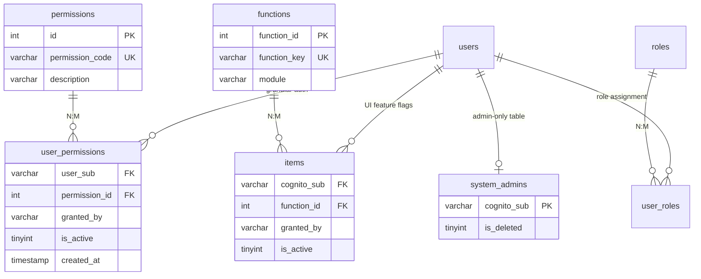
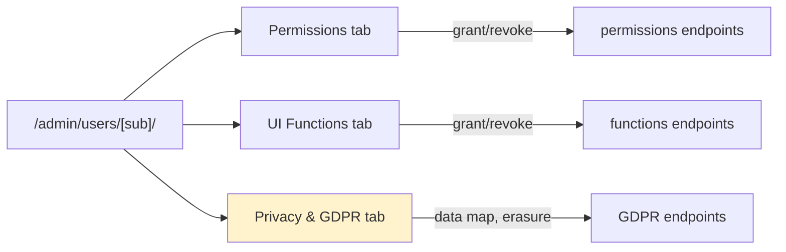
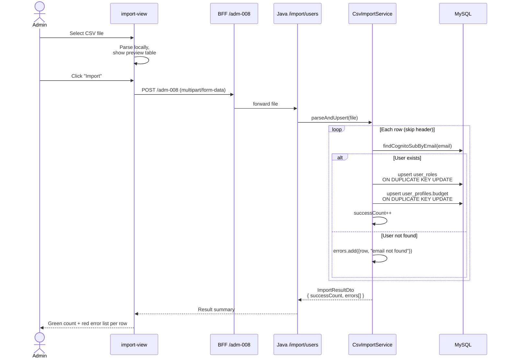

# Admin & User Management

How ADMIN role manages users, grants granular permissions, and imports data in bulk via CSV.

## Why "granular permissions, not just roles"

Common pattern: role = permission set. `MANAGER` = "can approve everything". Simple but coarse.

This project splits **role** from **permission**:
- **Role** is the user's job title (`EMPLOYEE / MANAGER / FINANCE`) — determines which nav sections appear in the sidebar.
- **Permission** is what they're allowed to *do* (`EXPENSE_APPROVE`, `FINANCE_EXPORT`) — checked at action time by the backend.

Concrete example: a senior employee could be granted `EXPENSE_APPROVE` without becoming a MANAGER. Or a MANAGER role could be revoked `EXPENSE_REJECT` while keeping `EXPENSE_APPROVE` — approve-only manager during a probation period.

**Role is a default; permission is the truth.**

---

## 1. Data model

Two parallel systems: **permissions** (authorization) and **functions** (UI feature flags).



### permissions vs functions vs system_admins

| Table | Purpose | Example values |
|---|---|---|
| **`permissions`** | Authorization scope enforced backend-side | `EXPENSE_APPROVE`, `EXPENSE_REJECT`, `FINANCE_VIEW`, `FINANCE_EXPORT` |
| **`functions`** | UI feature flags — which buttons/screens render | `EXPENSE_ACCEPT`, `FINANCE_VIEW_OVERVIEW` |
| **`system_admins`** | Separate table for admin identity — admin is NOT a `role` | `auth0|69db...admin` |

Why split into three:
- **Permissions vs functions** — you can grant `EXPENSE_APPROVE` (backend gate) without showing the Approve button in the UI (`EXPENSE_ACCEPT` function). Useful for API-only integrations, hidden admin overrides, and role-out plans.
- **Admin not a role** — the ADMIN identity lives in its own table (`system_admins`) with its own auth check (`existsBySub`). This means admins can't accidentally be given expense-approval powers by touching `user_permissions`; the two authorization surfaces are orthogonal.

---

## 2. Admin gate — `SystemAdminRepository.existsBySub`

Every admin controller starts with the same guard:

```java
// AdminController.java
private void requireAdmin(HttpServletRequest request) {
    String sub = (String) request.getAttribute("cognitoSub");
    if (!systemAdminRepository.existsBySub(sub)) {
        throw new ForbiddenException("Not a system admin");
    }
}
```

Backed by a trivial COUNT query:

```sql
SELECT COUNT(*) FROM system_admins
WHERE cognito_sub = #{sub} AND is_deleted = 0
```

The check runs on **every admin endpoint** — no shared filter, no annotation, no framework magic. Deliberate: makes it obvious in every controller that this endpoint requires admin, and impossible to accidentally forget the check on a new endpoint (missing call = 200 OK to anyone).

---

## 3. Users list — `/admin/users`

[`admin-users-list-view.tsx`](../frontend/components/admin/admin-users-list-view.tsx) renders a paginated table:

| Column | Source |
|---|---|
| Email | `users.email` |
| Role | joined from `user_roles → roles.role_name` |
| Status | `users.status` (active / inactive / banned) |
| Budget | `user_profiles.budget` |

Search box filters client-side by email + role substring. Clicking a row navigates to `/admin/users/[sub]` — see next section.

Backend endpoint: `GET /api/v1/admin/users` → returns the list, no pagination (small user base). For 100+ users this would need server-side pagination + search.

---

## 4. User detail — `/admin/users/[sub]`

[`admin-user-detail-view.tsx`](../frontend/components/admin/admin-user-detail-view.tsx) uses a 3-tab layout:



### The 3-state model

Both Permissions and Functions tabs render a **3-state grid**:

- **ACTIVE** — row in `user_permissions` (or `items`) exists AND `is_active = 1`
- **INACTIVE** — row exists but `is_active = 0` (previously granted, then revoked; kept for audit)
- **NEVER_GRANTED** — no row at all

The tab UI shows all possible permissions/functions, each with its current state and an action button (`Grant` / `Deactivate` / `Reactivate`).

Why keep `INACTIVE` rows instead of DELETE:
- Preserves `granted_by` and `created_at` audit trail
- Makes it clear "this user had X permission from date Y to date Z"
- Reactivation is instant (flip `is_active` back to 1) without needing to re-enter `granted_by`

### Grant permission endpoint

```java
// SystemAdminController.java
@PostMapping("/{sub}/permissions")
public ResponseEntity<String> grantPermission(
        HttpServletRequest request,
        @PathVariable String sub,
        @RequestBody Map<String, String> body) {
    String adminSub = (String) request.getAttribute("cognitoSub");
    permissionService.grantPermission(adminSub, sub, body.get("permissionCode"));
    return ok("Permission granted");
}
```

Backed by an idempotent UPSERT:

```xml
<insert id="grantPermission">
    INSERT INTO user_permissions (user_sub, permission_id, granted_by, is_active)
    VALUES (#{userSub}, #{permissionId}, #{grantedBy}, 1)
    ON DUPLICATE KEY UPDATE is_active = 1, granted_by = #{grantedBy}
</insert>
```

Same statement handles first-time grants AND reactivations. If it existed as INACTIVE, `is_active = 1` flips it back on and the current admin becomes the new `granted_by`.

Revoke is a simple `UPDATE ... SET is_active = 0` — no DELETE, no cascading effect on audit trails.

### Third tab — Privacy & GDPR

Detailed in [gdpr-compliance](/wiki/gdpr-compliance) — this tab is where admins process erasure requests. Not repeated here.

---

## 5. CSV import — `/admin/import`

[`admin-import-view.tsx`](../frontend/components/admin/admin-import-view.tsx) offers two import types via tabs:

- **Users CSV** — bulk create/update users with role + budget
- **Permissions CSV** — bulk grant/revoke permissions

### Users import format

```csv
Email,Role,Budget
anna.mueller@company.de,EMPLOYEE,5000.00
thomas.weber@company.de,MANAGER,15000.00
sarah.chen@company.de,FINANCE,50000.00
```

### Import flow



### Key design details

- **`ON DUPLICATE KEY UPDATE`** everywhere — imports are re-runnable. Uploading the same CSV twice is a no-op.
- **Row-level errors, batch-level success** — one bad row doesn't abort the import. The result DTO reports success count AND a list of `{ row, error }` for each failure. Admin sees exactly what to fix.
- **Client-side preview before submit** — the frontend parses the CSV in the browser and shows the first ~10 rows in a table. Admin can spot format problems (extra columns, comma-in-quoted-field issues) before uploading.
- **User creation is intentionally NOT done here** — user creation is Auth0's responsibility (signup or admin-created account). The CSV imports assume the user *already exists* in `users` and only updates role + budget. Prevents accidental creation of orphaned accounts.

### Permissions CSV format

```csv
User Email,Permission Code,Action
sarah.chen@company.de,FINANCE_EXPORT,GRANT
thomas.weber@company.de,EXPENSE_REJECT,REVOKE
```

Uses the same `PermissionService.grantPermission` / `.revokePermission` methods as the UI — same idempotency, same audit trail (`granted_by = <admin sub>`).

---

## 6. Endpoints

| BFF path | HTTP | Java target | Purpose |
|---|---|---|---|
| `/adm-001/users` | GET | `GET /api/v1/admin/users` | List all users |
| `/adm-002/:sub/permissions` | GET | `GET /api/v1/admin/users/{sub}/permissions/status` | 3-state permission grid |
| `/adm-003/:sub/permissions` | POST | `POST /api/v1/admin/users/{sub}/permissions` | Grant permission (body: `{ permissionCode }`) |
| `/adm-004/:sub/permissions/:code` | DELETE | `DELETE /api/v1/admin/users/{sub}/permissions/{code}` | Revoke (set `is_active=0`) |
| `/adm-005/:sub/functions` | GET | `GET /api/v1/admin/users/{sub}/functions/status` | 3-state functions grid |
| `/adm-006/:sub/functions` | POST | `POST /api/v1/admin/users/{sub}/functions` | Grant function |
| `/adm-007/:sub/functions/:key` | DELETE | `DELETE /api/v1/admin/users/{sub}/functions/{key}` | Revoke function |
| `/adm-008/import/users` | POST | `POST /api/v1/admin/import/users` | Users CSV (multipart) |
| `/adm-009/import/permissions` | POST | `POST /api/v1/admin/import/permissions` | Permissions CSV (multipart) |
| `/adm-010/template/:type` | GET | Download CSV template | Sample CSV headers |
| `/adm-018` — `/adm-021` | various | `/api/v1/admin/gdpr/*` | GDPR admin — see [gdpr-compliance](/wiki/gdpr-compliance) |

Every admin endpoint calls `requireAdmin(request)` before touching any data.

---

## 7. What's deliberately not built

- **User creation via CSV** — must exist in Auth0 first. Prevents accidental orphaned users with no OAuth identity.
- **Role deletion** — you can grant permissions to zero the role's power, but the `roles` table is seed-only. In production, adding new roles would be a migration, not runtime.
- **Bulk permission revocation for a departed employee** — currently one permission at a time. GDPR erasure (see [gdpr-compliance](/wiki/gdpr-compliance)) handles the "employee leaves" case by hard-deleting `user_roles` + `user_permissions` in one transaction.
- **Audit log for permission changes** — `granted_by` is recorded but there's no per-change history table. If a permission was granted then revoked then re-granted, we see only the current state + `granted_by = latest admin`. For full history, would need a `permission_changes` audit table.
- **Fine-grained system_admins** — currently binary (admin or not). No sub-roles like "read-only admin". Real deployments would need this.

---

## Related

- [Auth flow](/wiki/auth-flow) — how `cognitoSub` gets extracted for the admin gate
- [GDPR / DSGVO](/wiki/gdpr-compliance) — the Privacy & GDPR tab on user detail view
- [Architecture](/wiki/architecture) — where `SystemAdminRepository` sits in the layer diagram
