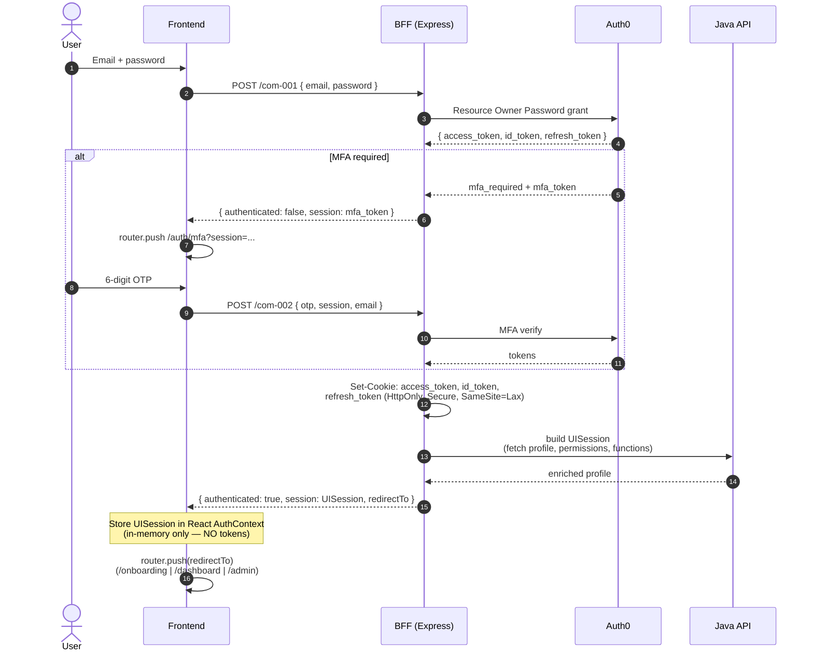
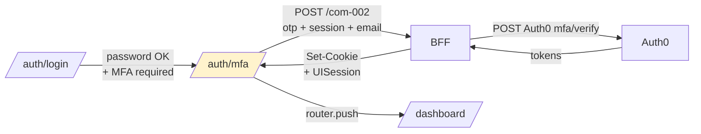
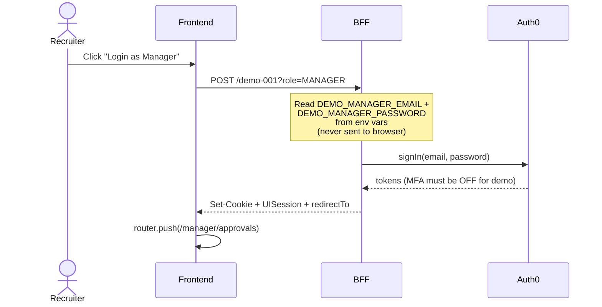

# Auth Flow

How a user goes from Auth0 login to holding a session that unlocks protected routes — and how tokens stay out of the browser the whole time.

## Why this design

The default OAuth2/OIDC pattern for SPAs stashes tokens in `localStorage` or `sessionStorage`. Any XSS then walks off with them. **This project keeps tokens on the server side** — HttpOnly cookies + a BFF that swaps token for API call. Frontend never sees `access_token`, `id_token`, or `refresh_token`.

That's the interesting part of the codebase for a security-conscious reviewer.

---

## 1. Login flow — end to end



The frontend ends up with only a `UISession` object. Tokens live exclusively in cookies the JavaScript cannot read.

---

## 2. Endpoints

### BFF ↔ Java mapping

| BFF path | HTTP | Java target | Purpose |
|---|---|---|---|
| `/com-001` | POST | `POST /api/auth/login` | Email+password → cookies + UISession |
| `/com-002` | POST | `POST /api/auth/mfa` | Verify OTP → cookies + UISession |
| `/com-004` | GET  | `GET  /api/auth/session` | Rehydrate UISession from cookies (page refresh) |
| `/com-005` | POST | `POST /api/auth/logout` | Revoke refresh token + clear cookies |
| `/demo-001` | POST | `POST /api/auth/demo-login` | One-click demo (BFF injects seeded credentials) |

The BFF is the only layer that touches raw tokens. Everything downstream (Java API, frontend) sees derived objects only.

### Session response shape

```typescript
// frontend/ducks/auth/types.ts
export interface UISession {
  user: {
    email: string;
    role: 'EMPLOYEE' | 'MANAGER' | 'FINANCE';
  };
  budget: number;
  onboardingStatus: 'PENDING' | 'DONE';
  permissions: string[];   // e.g. ["EXPENSE_APPROVE", "FINANCE_VIEW"]
  functions:  number[];    // UI feature-flag IDs
  isAdmin:    boolean;
}
```

**No `token` field.** Deliberate. If JavaScript ever needs to include tokens in requests, `credentials: 'include'` on `fetch` sends the cookie automatically — no code holds the token value.

---

## 3. JwtAuthFilter — how the Java API knows who's calling

Once the BFF forwards a request with the ID token in `Authorization: Bearer ...`, the Java side needs to extract the caller's identity. This happens in [`JwtAuthFilter.java`](../backend/src/main/java/com/example/my_java_app/config/JwtAuthFilter.java):

```java
protected void doFilterInternal(HttpServletRequest request, ...) {
    String authHeader = request.getHeader("Authorization");
    if (authHeader == null || !authHeader.startsWith("Bearer ")) {
        response.setStatus(SC_UNAUTHORIZED);
        return;
    }
    String token = authHeader.substring(7);
    String cognitoSub = extractSubFromJwt(token);
    request.setAttribute("cognitoSub", cognitoSub);   // ← available to every controller
    filterChain.doFilter(request, response);
}
```

`extractSubFromJwt` splits the JWT on `.`, base64url-decodes the payload, parses JSON, returns the `sub` claim.

### Deliberate design: decode-only, no signature verify

The filter does **not** call Auth0's JWKS endpoint to verify the RS256 signature. That's on purpose — the BFF already validated the token when it exchanged it with Auth0. By the time the Java API sees the token, it's been round-tripped through the BFF's cookie handling and can be trusted for the duration of the request.

**Trade-off:** if someone forges a JWT with a fake `sub` and can somehow inject it into the BFF-Java connection (which is inside the Docker network only), they'd bypass identity. In production this would tighten to signature verification against Auth0's public keys.

### Route exemption

```java
protected boolean shouldNotFilter(HttpServletRequest request) {
    return !request.getRequestURI().startsWith("/api/v1/");
}
```

Only `/api/v1/**` goes through the filter. Health checks, actuator endpoints, and `/api/auth/**` (which is on the BFF path, not Java) skip auth.

---

## 4. MFA branch

Not every user has MFA enabled — it's an Auth0 tenant-level flag. When it *is* enabled, login returns before yielding tokens:

```typescript
// login-view.tsx
const result = await login({ email, password }).unwrap();
if (isMfaRequired(result)) {
  router.push(`/auth/mfa?session=${result.session}&email=${email}`);
}
```

`result.session` here is Auth0's opaque `mfa_token`, valid for ~10 minutes. The frontend puts it in the URL query so the MFA page can pass it back:



The MFA route only exists as an intermediate step. If MFA succeeds, the user proceeds exactly like a non-MFA login. If it fails, they stay on `/auth/mfa` with an error state — the mfa_token stays valid so they can retry.

---

## 5. Session hydration on page refresh

React state is in-memory. Refresh the tab and the `AuthContext` is empty. This is where cookies matter:

```typescript
// AuthContext.tsx
const { data } = useGetSessionQuery(undefined, {
  skip: session !== null && isHydrated,
});
useEffect(() => {
  if (data?.authenticated) setSessionState(data.session);
}, [data]);
```

`useGetSessionQuery` calls `GET /com-004`. The BFF reads the cookies, decodes `id_token` (no verify), fetches the user profile + permissions + functions, and builds a fresh `UISession`.

```typescript
// bff/src/product/common/com-004/controller.ts
const tokens = getAuthCookies(req.cookies || {});
const decoded = jwt.decode(tokens.idToken);
const email = decoded.email;
const [userProfile, permissions, functions, isAdmin] = await Promise.all([...]);
return { authenticated: true, session: buildUISession(...) };
```

If the ID token has expired, the BFF uses the refresh token to get a new pair from Auth0 before responding. The frontend just sees a successful session response — token rotation is invisible.

---

## 6. Logout

```typescript
// bff/src/product/common/com-005/controller.ts
if (tokens?.refreshToken) {
  await revokeToken(tokens.refreshToken);   // Auth0 revocation, best-effort
}
clearAuthCookies(res);                       // ALWAYS clear cookies
```

Cookies always get cleared — even if the Auth0 revocation call fails. The frontend then calls `clearSession()` in AuthContext to null the in-memory UISession. Result: no token anywhere, all paths lead back to `/auth/login`.

---

## 7. Demo login — one-click without credentials in the browser

Portfolio pain point: recruiter opens the app and needs to try 4 roles without knowing 4 passwords. Solution:



The demo credentials are stored **only in BFF environment variables** (`DEMO_MANAGER_EMAIL`, `DEMO_MANAGER_PASSWORD`, etc.). Frontend has no knowledge of what those emails are — it just tells the BFF "log in as MANAGER" and lets the BFF handle the credential lookup.

Guard: demo accounts are checked for MFA and rejected if enabled — the intent is one-click, so MFA would break the pattern.

```typescript
// bff/src/product/common/demo-001/controller.ts
if (result.type === 'mfa_required') {
  return throwBffError('Demo accounts must not have MFA enabled.', 503);
}
```

This is why the seeded Auth0 tenant deliberately doesn't enroll MFA for demo users — with a note in the codebase explaining why.

---

## 8. What lives where — cheat sheet

| Layer | Contains | Reason |
|---|---|---|
| **HttpOnly cookie** (browser storage) | `access_token`, `id_token`, `refresh_token` | Not readable by JS → XSS-safe |
| **BFF memory** (per request) | Decoded token + user email | Ephemeral, dies with the request |
| **BFF env vars** | Demo credentials, Auth0 client secret | Never crosses the wire to the browser |
| **Java API request attribute** | `cognitoSub` (decoded from JWT) | Set by JwtAuthFilter, used by controllers |
| **Frontend React state** | `UISession` (no tokens) | Ergonomic — components read `role`, `permissions[]` |
| **Frontend `sessionStorage` / `localStorage`** | Nothing auth-related | Deliberate — no attack surface |

If a reviewer asks "how do you defend against a token theft via XSS?" the answer is: the token isn't in the DOM to steal.

---

## Related

- [Onboarding & consent](/wiki/onboarding) — what happens between login success and reaching `/dashboard`
- [Architecture](/wiki/architecture) — big-picture role of the BFF
- [GDPR / DSGVO](/wiki/gdpr-compliance) — how `cognitoSub` maps to erasure targets
