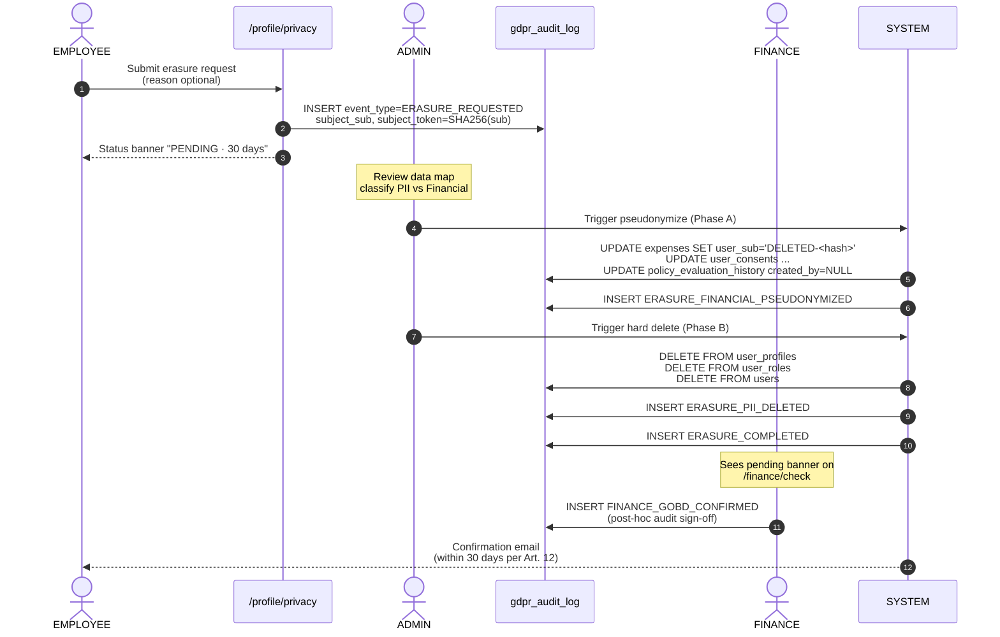
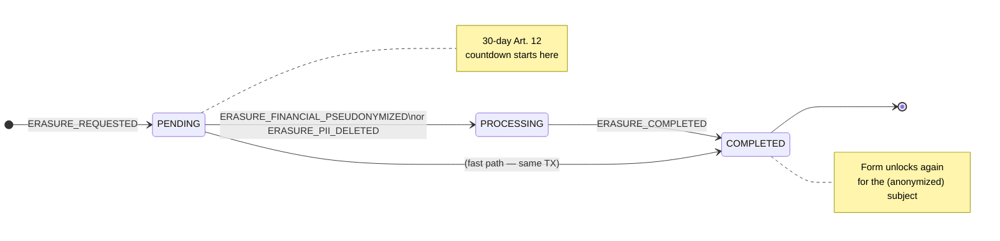
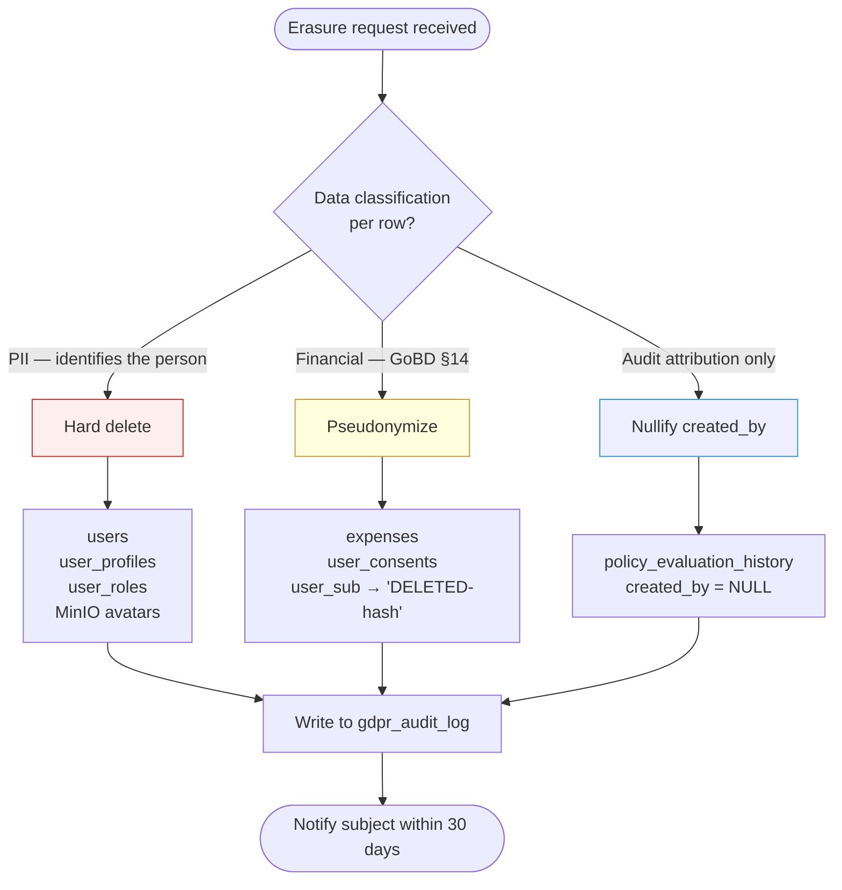
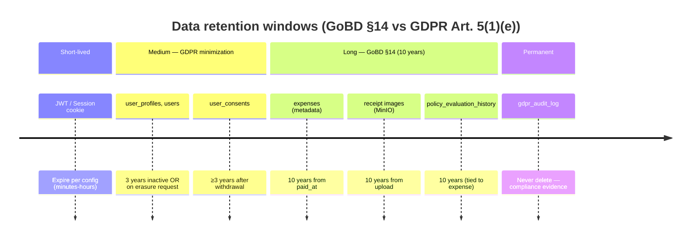
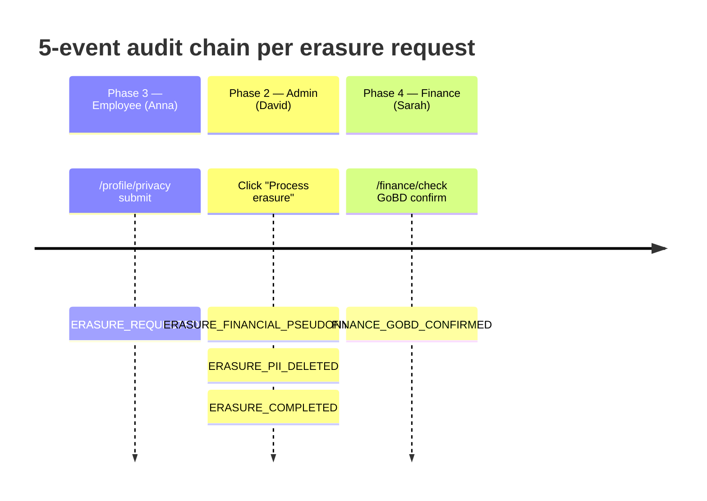

# GDPR / DSGVO Compliance

> Wiki page — FintechSaaS Expense Platform
> Scope: all GDPR/DSGVO concerns related to employee data processing
> Last updated: 2026-05

---

## 1. Context and the core tension

The system handles two data classes with **legally opposing requirements**:

| | Personal data | Financial records |
|---|---|---|
| Examples | Name, email, IBAN, avatar, `user_profiles` | Expense records, receipt images, DATEV export |
| Applicable law | GDPR Art. 17 — Right to Erasure | GoBD §14 — 10-year mandatory retention |
| On erasure request | **Must delete** | **Must NOT delete** |
| Resolution | Hard delete | Pseudonymization |

> **Design principle:** GDPR "right to erasure" and GoBD "retention obligation" do not conflict once the two data classes are cleanly separated. The industry-standard resolution is **pseudonymization** — remove identifying information, preserve the financial numbers.

---

## 2. Data Classification

### 2.1. Personal data — erasable under GDPR

| Table | Specific fields | Action on erasure |
|------|-------------|----------------------|
| `users` | `email`, `cognito_sub` | Hard delete row |
| `user_profiles` | `first_name`, `last_name`, `avatar_url`, `language_code` | Hard delete row |
| `user_permissions` | all | Hard delete rows |
| `user_roles` | all | Hard delete rows |
| `user_consents` | all | Hard delete rows (after exporting a copy) |
| MinIO | User's receipt images | Delete objects |

### 2.2. Financial records — must be retained under GoBD

| Table | Fields to retain | Fields to pseudonymize |
|------|--------------|---------------------|
| `expenses` | `amount`, `vat_amount`, `expense_type`, `status`, `submitted_at`, `reviewed_at`, `paid_at`, `receipt_date`, `distance_km`, `per_diem_days`, `country_code` | `user_id` → replace with anonymized token `[DELETED-{hash}]` |
| `policy_evaluation_history` | all `result_json`, `input_json` (numeric data) | `entity_id` where it points to a user |
| `expense_reports` | `content` (aggregated markdown) | Employee names in the content → `[Employee]` |
| `finance_reports` | all | No direct PII — kept as-is |

> **Why retain receipt images of PAID expenses:** A receipt is an accounting document (Buchungsbeleg). GoBD requires the original to be preserved. However, if the employee's name/email appears on the receipt and can be OCR-extracted, it should be redacted rather than deleting the file entirely.

---

## 3. Roles and responsibilities

### 3.1. ADMIN — Data Controller / DPA

ADMIN is the only role authorized to execute a GDPR request. In business terms, ADMIN acts as **Datenschutzbeauftragter (DPA)** — the person legally accountable for data processing.

**Permissions and screens:**

- `/admin/users` → **"Privacy & GDPR"** tab (integrated into the existing page, no separate route)
  - Erasure request queue: pending / processing / done list
  - Data map per user: which tables hold this user's data
  - Consent records: version, timestamp, IP at time of consent
  - Retention schedule: when each record becomes eligible for deletion (PAID date + 10 years)
  - **"Process erasure"** button → triggers the erasure/pseudonymization workflow
  - Export data subject report (Art. 15 — Right of Access)

**Deadline:** GDPR Art. 12 requires a response within **30 days** of receiving the request. The system surfaces a deadline countdown in the queue.

### 3.2. FINANCE — GoBD Gatekeeper

FINANCE does not process GDPR requests directly, but a mandatory confirmation step exists before expense records may be pseudonymized.

**Related screen:**

- `/finance/check` → adds a **"Retention status"** column to every expense row:
  - `UNDER_RETENTION` — still within the 10-year GoBD window, cannot be deleted
  - `RETENTION_EXPIRED` — eligible for full deletion
- When Admin triggers pseudonymization, Finance receives a notification → **"Confirm GoBD pseudonymization"** → writes an audit log entry

**Why Finance must confirm:** Separation of duties. Admin can execute GDPR actions but must not unilaterally alter financial records. Finance is accountable for the integrity of accounting data.

### 3.3. EMPLOYEE — Data Subject

Employees exercise their basic GDPR rights through:

- `/profile/privacy` — **Privacy Center** (a dedicated screen)
  - List of data categories currently held (category, since when)
  - **"Download my data"** button → ZIP export (JSON or CSV) — GDPR Art. 20
  - **"Request deletion"** button → opens a ticket to ADMIN, status visible to the employee
  - Consent history: which policy versions were accepted, when

---

## 4. Erasure Request Workflow

### 4.1. End-to-end sequence



### 4.2. Erasure request status lifecycle

The frontend derives status by checking which follow-up events exist for the same `subject_token`:



### 4.3. Data classification split — which path per table



---

## 5. Audit Log for Personal Data

Every GDPR erasure/export action is written to a dedicated table — never mixed with `policy_evaluation_history`.

> **Design decision:** Consent events (`CONSENT_GIVEN`, `CONSENT_WITHDRAWN`) are **NOT** written to `gdpr_audit_log`. `user_consents` already carries `ip_address`, `user_agent`, and `revoked_at`, which are a sufficient audit trail. Writing to both places would cause inconsistency. `gdpr_audit_log` tracks only erasure and export actions.

**Proposed table: `gdpr_audit_log`**

```sql
CREATE TABLE gdpr_audit_log (
  id            BIGINT AUTO_INCREMENT PRIMARY KEY,
  event_type    ENUM(
                  'ERASURE_REQUESTED',        -- employee submits request
                  'ERASURE_PII_DELETED',      -- admin hard-deletes PII tables
                  'ERASURE_FINANCIAL_PSEUDONYMIZED', -- finance confirms + pseudonymize
                  'ERASURE_COMPLETED',        -- full workflow done
                  'DATA_EXPORTED'             -- employee downloads ZIP (Art. 20)
                ) NOT NULL,
  subject_sub   VARCHAR(64),       -- cognito_sub of the subject (nullable after erasure)
  subject_token VARCHAR(64) NOT NULL, -- SHA-256(cognito_sub) — preserved after sub is deleted
  actor_sub     VARCHAR(64),       -- admin/finance who performed the action (null if system action)
  actor_role    VARCHAR(32),
  details_json  JSON,              -- { tables_affected, rows_deleted, reason, request_id }
  created_at    DATETIME NOT NULL DEFAULT CURRENT_TIMESTAMP
  -- no FK back to users — intentional, since the user may already be deleted
);
```

> **Design note:** `subject_sub` is nullable — becomes NULL after hard delete. `subject_token = SHA-256(cognito_sub)` is not reversible; it links events within the same erasure workflow after the PII has been deleted. Intentionally no FK on `users`. This table **must never be deleted** — it is compliance evidence.

---

## 6. Consent Management

### 6.1. Current schema — gap analysis

**What exists today:**
```sql
-- policies: id, title, slug, version, content, is_current_active, created_at, is_deleted
-- user_consents: id, user_sub, policy_id, ip_address, user_agent, created_at, revoked_at
```

**Sufficient for:**
- Recording consent given (`created_at`) and withdrawn (`revoked_at`) ✓
- Tracking IP and user agent at time of consent ✓
- Knowing which policy version the user currently accepts ✓

**Gap 1 — `user_consents` is missing `consent_method`**

GDPR Art. 7 requires demonstrating *how* consent was obtained. We currently can't distinguish a normal checkbox click from a one-click demo login. Needed:

```sql
ALTER TABLE user_consents
  ADD COLUMN consent_method ENUM('explicit_checkbox', 'demo_login', 'api_import') NOT NULL DEFAULT 'explicit_checkbox'
  AFTER user_agent;
```

> **Why this matters:** Demo login users (Anna Müller, Thomas Weber…) carry `consent_method = 'demo_login'` — clearly separated from real users so audits don't confuse the two.

**Gap 2 — `policies` is missing `policy_type`**

`slug` currently carries the policy-type distinction. The query "did user X accept the AI data processing policy?" has to string-match on slug — fragile on rename. Add:

```sql
ALTER TABLE policies
  ADD COLUMN policy_type ENUM('TERMS_OF_SERVICE', 'PRIVACY_POLICY', 'AI_DATA_PROCESSING') NOT NULL DEFAULT 'TERMS_OF_SERVICE'
  AFTER slug;
```

The consent check for the AI feature then becomes:
```sql
SELECT uc.id FROM user_consents uc
JOIN policies p ON uc.policy_id = p.id
WHERE uc.user_sub = ? AND p.policy_type = 'AI_DATA_PROCESSING'
  AND uc.revoked_at IS NULL;
```

**Gap 3 — FK constraint blocks erasure (critical)**

`user_consents.user_sub` currently FKs to `users(cognito_sub)`. On hard delete of a user, two scenarios exist:

| Option | Behavior | Problem |
|--------|-----------|--------|
| `ON DELETE CASCADE` | Delete consent records too | Loses evidence that consent was ever given — violates GDPR's "demonstrate compliance" |
| `ON DELETE RESTRICT` | Block the delete | User cannot be erased |
| **Recommended** | Drop FK, use `subject_token` | Keep consent record but anonymize `user_sub` |

**Solution:** Before hard-deleting the user, run:
```sql
-- 1. Anonymize user_sub in consent records (preserve the evidence)
UPDATE user_consents
  SET user_sub = CONCAT('DELETED-', SHA2(user_sub, 256))
  WHERE user_sub = ?;

-- 2. Now delete the user (FK no longer references)
DELETE FROM users WHERE cognito_sub = ?;
```

> Drop FK `fk_uc_user`, or switch to `ON DELETE SET NULL` and allow `user_sub` to be nullable in `user_consents`.

### 6.2. When must the user consent

- First login → Terms of Service + Privacy Policy (`policy_type IN ('TERMS_OF_SERVICE', 'PRIVACY_POLICY')`)
- When a new `is_current_active` policy is published → show re-consent modal on next login
- On first OCR receipt upload → AI Data Processing policy (`policy_type = 'AI_DATA_PROCESSING'`)

### 6.3. Withdrawal of consent

If a user revokes AI consent (`revoked_at` is set), the backend gates every call to `POST /expenses/scan`: no active AI consent → the endpoint falls back to manual entry, no Groq call.

> **No pre-ticked checkboxes.** GDPR Art. 7: consent must be a "freely given, specific, informed and unambiguous indication". Checkboxes ship unchecked. One-click demo login is recorded as `consent_method = 'demo_login'` and must not be used as real consent evidence.

---

## 7. Data Retention Schedule



| Data category | Retention period | Legal basis | Action on expiry |
|-------------|-----------------|---------------|----------------------|
| `user_profiles`, `users` | Until erasure request, or 3 years inactive | GDPR Art. 5(1)(e) | Auto-delete job |
| `expenses` (metadata) | 10 years from PAID date | GoBD §14 | Auto-pseudonymize if user requested erasure |
| Receipt images (MinIO) | 10 years from upload | GoBD — Buchungsbeleg | Preserve; redact names if needed |
| `policy_evaluation_history` | 10 years (linked to expense) | GoBD | Pseudonymize `entity_id` |
| `gdpr_audit_log` | Forever | Compliance evidence | Never delete |
| `user_consents` | Minimum 3 years after withdrawal | GDPR "demonstrate compliance" | Archive, no hard delete |
| Session / JWT | HttpOnly cookie — expires per config | GDPR data minimization | Auto-expire |

---

## 8. Screens to create / modify

### 8.1. New: `/profile/privacy` — Privacy Center (EMPLOYEE)

**Navigation location:** Settings → Privacy & Data

**Components:**
- **Data inventory card:** categories held (Profile data, Expense history, AI-processed receipts) with retention start date
- **Download data button:** `GET /api/v1/user/data-export` → returns a ZIP containing JSON of all user data
- **Erasure request form:** textarea for reason (optional) + submit → creates a row in the Admin queue
- **Erasure status tracker:** if a request exists, show its state (Pending / Processing / Completed)
- **Consent history table:** policy version, date accepted, status (Active / Withdrawn)

### 8.2. New: "Privacy & GDPR" tab in `/admin/users` (ADMIN)

**Location:** Open user detail → 4th tab "Privacy & GDPR" (after Roles, Permissions, Activity)

**Components:**
- **Erasure request queue:** filter by status, 30-day deadline countdown
- **Data map:** accordion per table — how many rows still hold this user's data
- **Action panel:** "Process erasure" button → confirmation modal with a checklist
  - [ ] PII data will be hard-deleted
  - [ ] Financial records will be pseudonymized
  - [ ] Finance team has been notified
  - [ ] Audit log will be created
- **Consent records:** read-only timeline

### 8.3. Modify: `/finance/check` — add Retention status (FINANCE)

**Small change:** add a "Retention" column to the expense list:
- `UNDER RETENTION` badge (amber) — still within GoBD 10-year window
- `EXPIRED` badge (green) — eligible for deletion

**New notification panel:** when Admin triggers a pseudonymize request, Finance sees a banner → "Confirm GoBD pseudonymization for [X] expenses" → approve/decline.

---

## 9. API endpoints to add

```
EMPLOYEE
  GET    /api/v1/user/privacy/data-map        View data being held
  POST   /api/v1/user/privacy/erasure-request Submit erasure request
  GET    /api/v1/user/privacy/erasure-status  Current request status
  GET    /api/v1/user/data-export             Download ZIP of all data

ADMIN
  GET    /api/v1/admin/gdpr/requests          Erasure request queue
  GET    /api/v1/admin/gdpr/data-map/{sub}    Data map for one user
  POST   /api/v1/admin/gdpr/process/{id}      Trigger erasure workflow
  GET    /api/v1/admin/gdpr/audit-log         GDPR audit log

FINANCE (notification)
  GET    /api/v1/finance/gdpr/pending         Pending pseudonymize confirmations
  PUT    /api/v1/finance/gdpr/confirm/{id}    Confirm pseudonymize
```

---

## 10. Implementation checklist (by priority)

### Phase 1 — Foundation ✅ DONE (7 new files, 5 schema changes)
- [x] Create `gdpr_audit_log` table — no FK, `subject_token` SHA-256, append-only
- [x] `GdprService.java` — 4 methods: `recordErasureRequest`, `pseudonymizeFinancialData`, `hardDeletePersonalData`, `recordDataExport`. `@Transactional`, idempotent.
- [x] `GdprAuditLogEntity` + `GdprAuditLogMapper` + `GdprAuditLogRepository`
- [x] `GdprMapper.java` + XML — cross-cutting SQL for pseudonymize + hard delete
- [x] `retention_expires_at DATE` + index on `expenses`
- [x] `consent_method` ENUM on `user_consents`
- [x] `policy_type` ENUM on `policies` + seed AI Data Processing policy
- [x] Drop FK `user_consents → users` (Gap 3 from schema review)
- [x] Drop FK `expenses → users`

**Phase 1 follow-up ✅ DONE (5 files)**
- [x] `paid_at TIMESTAMP NULL` added to `expenses` — no more hack via `updated_at`
- [x] `markPaid` + `markBatchPaid` SET `paid_at = NOW()` + `retention_expires_at = DATE_ADD(CURDATE(), INTERVAL 10 YEAR)` atomically in a single UPDATE
- [x] `ExpenseEntity` adds `paidAt` + `retentionExpiresAt`
- [x] `ExpenseMapper.xml` ResultMap + 2 updated queries, `updated_at` hack removed
- [x] `FinanceService` cleaned up leftover `DateTimeFormatter` + `now()` helpers
- [x] Comment in `db_fix.sql` documents the populate rule + backfill statement for real production migration

> Clear semantics: `paid_at` = when payment happened; `retention_expires_at` = when deletion is permitted. Two independent fields, neither piggybacks on the other.

### Phase 2 — Admin tooling ✅ DONE (11 new files + 2 schema updates)

**Backend**
- [x] `GdprController.java` — 4 endpoints under `/api/v1/admin/gdpr/*`, `requireAdmin` per method
- [x] `GdprErasureRequestDto` / `GdprDataMapDto` / `GdprAuditLogEntryDto` — response shapes
- [x] `GdprMapper.java + XML` — 6 count queries for data-map (profiles, roles, consents, policy_eval, expenses, users)
- [x] `GdprAuditLogMapper` — `findById`, `findAllErasureRequests`, `findRecent`, `existsLaterEvent`
- [x] `GdprService` — bug fix: `ERASURE_COMPLETED` keeps `subject_sub` instead of nulling it; `subjectTokenFor()` exposed public
- [x] BFF: 4 new endpoints `adm-018` → `adm-021`

**Frontend**
- [x] `adminApi.ts` — 4 endpoints + 3 cache tags + invalidation chain after `process`
- [x] `types.ts` — 5 new types (`GdprErasureRequest`, `GdprDataMap`, `GdprAuditEntry`, …)
- [x] `admin-user-detail-view.tsx` — refactored into 3 tabs: Permissions / UI Functions / **Privacy & GDPR**
- [x] `gdpr-privacy-panel.tsx` — 3 sections: erasure status + countdown, data map accordion, audit timeline
- [x] `gdpr-confirm-modal.tsx` — 4-item checklist, confirm button disabled until all ticked

**Schema**
- [x] `TableMaster.sql` updated with Phase 1 + Phase 2 changes
- [x] `db_fix.sql` seeds one demo `ERASURE_REQUESTED` for Anna Müller

**Working demo flow:** Admin → Anna Müller → Privacy & GDPR tab → Process erasure → checklist modal → Confirm → audit timeline shows 3 events → data map shows 0 PII rows

---

**✅ Verified:**

**1. Code order in `hardDeletePersonalData()`**
```
Line 98-100: deleteUserProfile → deleteUserRoles → deleteUser
Line 106:    writeAudit("ERASURE_PII_DELETED")
Line 110:    writeAudit("ERASURE_COMPLETED")
```
DELETE runs before audit write in code order — but this is fine because the entire method is `@Transactional`. 3 DELETEs + 2 audit INSERTs run in one transaction; no outside observer sees anything until COMMIT. If any statement fails → full rollback, no "user deleted but audit missing" scenario. Current order is **fine — no need to change**.

**2. Two-phase erasure order in controller**
`pseudonymizeFinancialData()` → `hardDeletePersonalData()` — matches the spec. ✅

---

**⚠️ Known edge case — silent `details_json` loss (acceptable)**

`writeAudit()` has a try-catch that swallows ObjectMapper errors (lines 132–135):
```java
try {
    entity.setDetailsJson(objectMapper.writeValueAsString(...));
} catch (Exception ex) {
    log.warn("Failed to serialize GDPR audit details...");
    entity.setDetailsJson("{}");  // content lost, INSERT still runs
}
```

Consequence: if serialization fails → `details_json = "{}"`, but the transaction still commits → DELETEs persist. `event_type` + `subject_token` + `timestamp` are still written → GDPR Art. 30 (recording obligation) not violated. Only `details` (which tables, how many rows) is lost — acceptable for portfolio scope. Real production should escalate to an error rather than a warning.

### Phase 3 — Employee self-service ✅ DONE (11 new files + seed data)

**Backend**
- [x] `UserPrivacyController.java` — 5 endpoints under `/api/v1/user/privacy/*` + `/data-export`, auth from `JwtAuthFilter`
- [x] `DataExportService.java` — ZIP containing `manifest.json` + `profile.json` + `expenses.json` + `consents.json` + `gdpr_audit_log.json`. Writes its own `DATA_EXPORTED` audit event.
- [x] `UserConsentEntity` + `UserConsentMapper` + `UserConsentRepository` — JOINs `policies` table
- [x] `UserConsentDto` + `CreateErasureRequestDto`
- [x] Logic: reject duplicate active request (one active request at a time — GDPR best practice)

**BFF**
- [x] 5 endpoints `emp-008` → `emp-012`. ZIP endpoint uses `axios responseType: 'stream'` + `pipe(res)` — no in-memory file buffering ✓

**Frontend**
- [x] `/profile/privacy` route + `PrivacyCenterView` — 4 sections: status banner, data inventory, consent history, erasure form
- [x] `privacyApi.ts` — dedicated RTK Query slice. Download uses `fetch + blob` (bypasses RTK — correct for binary streams)
- [x] `store.ts` — registers `privacyApi` reducer + middleware
- [x] `SettingsView.tsx` — adds "Privacy & Data" link card in the Security tab

**Schema / seed**
- [x] 3 consent rows for Anna (ToS + Privacy Policy + AI Data Processing) — demo consent history

**Working demo flow:** Settings → Security → Privacy & Data → `/profile/privacy` → PENDING banner + data inventory (6 tables) + consent history (3 rows) + download ZIP → admin audit log gains a `DATA_EXPORTED` entry

---

**✅ Verified: BFF stream pattern is correct**
`emp-012` uses `pipe(res)` instead of buffering — important because a user's ZIP export can be large if they have many expenses. Buffering in BFF RAM would cause memory spikes; streaming resolves it cleanly.

**✅ Verified: Banner copy — 3 required elements present**
1. *"deletion request is being processed"* — confirms the action was received
2. *"within 30 days per GDPR Art. 12"* — links to gdpr-info.eu (German-hosted, industry-standard reference). **Art. 12 is the correct citation**: it governs the response deadline; **not** Art. 17 (which is the right to erasure — a user right, not a controller obligation)
3. *"form is hidden until your current request is resolved (one active request at a time)"* — explicit UX, not a bug

Overdue copy: *"Overdue by X day(s) — our compliance team has been alerted."* — regulated-software pattern: the user knows someone is accountable, without exposing implementation detail.

### Phase 4 — Finance integration ✅ DONE (8 new files + 2 schema updates)

**Backend**
- [x] `FinanceGdprController.java` — 2 endpoints under `/api/v1/finance/gdpr/*`, `FINANCE_VIEW` permission check
- [x] `GdprService.confirmFinanceGobd()` — writes `FINANCE_GOBD_CONFIRMED` to the audit log
- [x] `GdprAuditLogMapper` — `findPendingFinanceConfirmations()` uses `NOT EXISTS` to find pseudo events without a confirmation — idempotency guard
- [x] `ExpenseResponseDto` — adds `paidAt` + `retentionExpiresAt` for FE badge rendering
- [x] `gdpr_audit_log.event_type` ENUM adds `FINANCE_GOBD_CONFIRMED`

**BFF**
- [x] `fin-006` (GET pending) + `fin-007` (PUT confirm)

**Frontend**
- [x] `financeGdprApi.ts` — RTK slice, registered in store
- [x] `check-view.tsx` — 4 sub-components: `RetentionBadge`, `GoBDConfirmationBanner`, `PaidRow`, `PendingConfirmationsModal`

**RetentionBadge logic:**
```
null (not yet PAID)             → dash —
retentionExpiresAt > today      → 🟡 UNDER RETENTION, tooltip "GoBD §14 — until YYYY-MM-DD"
retentionExpiresAt <= today     → 🟢 EXPIRED, tooltip "eligible for hard deletion"
```

**GoBDConfirmationBanner:** explicit separation of duties copy — *"accounting integrity is Finance's responsibility"*. Only shown when `pendingConfirmations.length > 0`.

**Demo seed:**
- Anna's DB Bahn ticket (paid 2026-04-15) → amber badge, retention until 2036-04-15
- Legacy office supplies (paid 2014-03-20) → green badge, expired 2024-03-20
- Pre-processed erasure → banner immediately shows count = 1

---

**✅ Noteworthy: `NOT EXISTS` idempotency guard**
`findPendingFinanceConfirmations()` finds `ERASURE_FINANCIAL_PSEUDONYMIZED` events where `NOT EXISTS` a matching `FINANCE_GOBD_CONFIRMED` event with the same `subject_token`. Meaning: confirming twice creates no duplicate confirmation and throws no error — the second call simply returns an empty list. This is the correct pattern for an audit-trail system: append-only log + idempotent reads.

---

## GDPR feature — end-to-end summary ✅ COMPLETE

**Cross-phase audit trail for one erasure request** — 5 events linked by `subject_token = SHA256(cognito_sub)`:



5 events, 3 actors (Employee → Admin → Finance), 4 phases, one `subject_token` linking them end to end.

**Total new files:** ~37 (backend + BFF + frontend) + 6 schema changes
**Phases:** 4 — Foundation → Admin → Employee → Finance
**German compliance covered:** GDPR Art. 12 (30-day response), Art. 17 (erasure), Art. 20 (portability / ZIP export), Art. 30 (audit log), GoBD §14 (10-year retention)

---

## 11. Related wiki pages

- [Architecture](./architecture.md) — C4 diagram with Auth0/Cognito as external identity system
- [GoBD notes](./gobd-notes.md) — 10-year retention and MinIO WORM storage details
- [API reference](./api-reference.md) — full endpoint list including GDPR endpoints
- [Tax export](./tax-export.md) — DATEV export contains no direct PII (Kostenstelle, Konto only)
