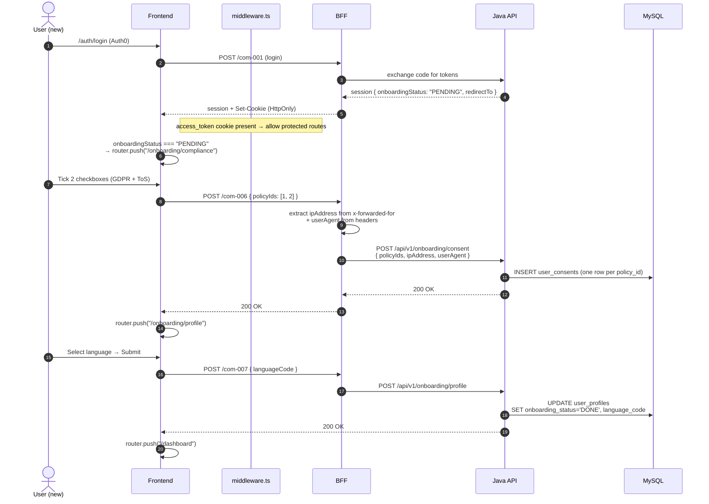

# Onboarding & Consent Flow

New-user flow from first login to landing on the app — consent capture is the compliance-critical part.

## Why this matters

Under **DSGVO Art. 7**, the controller must be able to demonstrate that the data subject has consented to processing. That means every consent event needs a durable record with **who**, **which policy version**, **when**, **from where** (IP), and **using what** (user-agent). This flow is where that evidence is produced.

---

## 1. Sequence — first login through completion



---

## 2. Routes and files

| Route | File | Purpose |
|---|---|---|
| `/onboarding` | [`app/(onboarding)/onboarding/page.tsx`](../frontend/app/(onboarding)/onboarding/page.tsx) | Landing — auto-redirects to `/onboarding/compliance` |
| `/onboarding/compliance` | [`app/(onboarding)/onboarding/compliance/page.tsx`](../frontend/app/(onboarding)/onboarding/compliance/page.tsx) | 2-checkbox consent screen (`compliance-view.tsx`) |
| `/onboarding/profile` | [`app/(onboarding)/onboarding/profile/page.tsx`](../frontend/app/(onboarding)/onboarding/profile/page.tsx) | Language + profile confirmation (`profile-view.tsx`) |

Layout wraps all onboarding pages with a centered card + ISO 27001 footer badge.

---

## 3. Consent capture — the compliance-critical piece

### What the user sees

Two required checkboxes on `/onboarding/compliance`:

- **GDPR consent** — links to Privacy Policy
- **Terms of Service** — links to ToS

The Continue button is disabled until both are ticked (`canProceed = checked1 && checked2`). No dark UX patterns — checkboxes are unchecked by default, no pre-selection.

### What gets stored

Frontend calls `POST /com-006` with body `{ policyIds: [1, 2] }`. The BFF then enriches the request with headers extracted server-side:

```typescript
// bff/src/product/common/com-006/controller.ts
const ipAddress =
  (req.headers['x-forwarded-for'] as string)?.split(',')[0]?.trim() ||
  req.socket?.remoteAddress ||
  'unknown';
const userAgent = req.headers['user-agent'] || 'unknown';
```

The BFF forwards `{ policyIds, ipAddress, userAgent }` to the Java API, which inserts **one row per policy_id** into `user_consents`:

```java
// UserConsentMapper.insertConsent
void insertConsent(
    @Param("userSub") String userSub,
    @Param("policyId") int policyId,
    @Param("ipAddress") String ipAddress,
    @Param("userAgent") String userAgent
);
```

Resulting row fields (see `user_consents` schema):

| Column | Value |
|---|---|
| `user_sub` | Cognito sub of the consenting user (VARCHAR(80) — no FK, for later GDPR anonymization) |
| `policy_id` | 1 (ToS) or 2 (Privacy Policy) |
| `ip_address` | From `x-forwarded-for` or socket |
| `user_agent` | From request header |
| `consent_method` | Default `'explicit_checkbox'` (ENUM: `explicit_checkbox / demo_login / api_import`) |
| `created_at` | `CURRENT_TIMESTAMP` |
| `revoked_at` | `NULL` (set later if consent withdrawn) |

**Two rows** are written per consent event — one for ToS, one for Privacy. This makes it easy to query "did user X accept privacy policy version Y" without composite parsing.

### The `policies` table — what gets consented to

Seeded in [`db_fix.sql`](../db_fix.sql):

| id | title | slug | policy_type | version |
|----|---|---|---|---|
| 1 | Terms of Service | `tos` | `TERMS_OF_SERVICE` | 1.0 |
| 2 | Privacy Policy | `privacy` | `PRIVACY_POLICY` | 1.0 |
| 3 | AI Data Processing | `ai-data` | `AI_DATA_PROCESSING` | 1.0 |

Note that **`AI_DATA_PROCESSING` (id=3) is NOT consented to during onboarding**. It's requested separately when the user first uploads a receipt for OCR — a lazier-loading consent pattern that avoids DSGVO Art. 5(1)(c) "data minimization" concerns for users who never scan.

---

## 3a. How the backend decides `onboardingStatus`

There is no dedicated status column. The backend infers status from the **existence of a `user_profiles` row** for the user's Cognito sub:

```java
// UserProfileService.getMyProfile
UserProfileEntity profile = userProfileRepository.findByUserSub(cognitoSub);
String onboardingStatus = (profile != null) ? "DONE" : "PENDING";
```

Implication:

- First login → no row → `PENDING` → BFF redirects to `/onboarding`.
- After `POST /com-007` succeeds → INSERT into `user_profiles` → next login returns `DONE` → BFF redirects to `/dashboard`.
- The `user_consents` rows are **not** part of this check — they are the compliance evidence, but the routing decision is purely `user_profiles` existence. Deleting only consents will not re-trigger onboarding.

---

## 4. Profile setup

The second step captures `language_code` (interface locale — `en`, `de`, `vi`) and marks onboarding complete:

```java
// OnboardingController
@PostMapping("/profile")
public ResponseEntity<Void> saveProfile(HttpServletRequest request, @RequestBody ProfileSetupRequestDto dto) {
    String cognitoSub = (String) request.getAttribute("cognitoSub");
    onboardingService.saveProfile(cognitoSub, dto);
    return ResponseEntity.ok().build();
}
```

Server-side: `INSERT/UPDATE user_profiles` with `language_code` and setting the flag that flips `onboardingStatus` → `DONE`. Next login returns `redirectTo: '/dashboard'` and skips the onboarding path entirely.

Read-only info shown on the profile screen (from the session, not editable): role, tier badge ("L1"), spend limit, status. These come from admin-side provisioning; the employee only chooses their language.

---

## 5. Routing guard

```mermaid
flowchart TD
    Login[User logs in] --> Cookie{access_token<br/>cookie set?}
    Cookie -->|no| LoginPage[redirect /auth/login]
    Cookie -->|yes| Session[Frontend reads session.<br/>onboardingStatus]

    Session -->|PENDING| Compliance[/onboarding/compliance/]
    Session -->|DONE| Dashboard[/dashboard/]

    Compliance --> Submit1[POST /com-006<br/>+ ipAddress + userAgent]
    Submit1 --> Profile[/onboarding/profile/]
    Profile --> Submit2[POST /com-007<br/>{ languageCode }]
    Submit2 -->|onboardingStatus flipped to DONE| Dashboard

    style Compliance fill:#fff3cd
    style Profile fill:#fff3cd
    style Dashboard fill:#d4edda
```

**Enforcement:**
- **Route-level:** [`middleware.ts`](../frontend/middleware.ts) — checks the `access_token` cookie exists; if missing → redirect to `/auth/login`. No explicit onboarding-status guard at middleware level.
- **App-level:** After login, the frontend inspects `session.onboardingStatus` and calls `router.push()` to the appropriate route. This is client-side routing — a determined user could open `/dashboard` directly, but the backend won't accept most business calls without a completed profile (specifically, `user_profiles.user_sub` must exist for expense creation).

---

## 6. Withdrawing consent (out of scope for onboarding, referenced here)

Users don't lose access if they withdraw. Instead:

- Consent record stays (`user_consents` row is kept) but `revoked_at` is set to the withdrawal timestamp.
- If withdrawn AI Data Processing consent (`policy_type = 'AI_DATA_PROCESSING'`): the BFF gates `POST /expenses/scan` on an **active** (`revoked_at IS NULL`) consent — no active row means the endpoint falls back to manual entry with no Groq call.
- For ToS/Privacy withdrawal: this triggers the GDPR erasure workflow (see [gdpr-compliance.md](/wiki/gdpr-compliance)) rather than staying logged in with revoked consent.

---

## 7. What the code deliberately does not do

- **No pre-ticked checkboxes.** DSGVO Art. 7(1) requires consent to be a "clear affirmative action" — a pre-ticked box does not qualify.
- **No dark-pattern reject flow.** Both checkboxes are equal weight; there's no "Reject all" button that's smaller/greyed out.
- **No consent bundling for AI.** AI Data Processing is a separate policy_id (3), consented to later at first OCR use — not bundled into the onboarding tick.
- **No JavaScript-side IP capture.** IP address is read server-side by the BFF from `x-forwarded-for` / `socket.remoteAddress`. Client-provided IPs would be spoofable and non-evidential.

---

## 8. Dev / QA — resetting a user to re-run onboarding

Because the routing decision is based on `user_profiles` existence (see §3a), resetting a test user is a two-table delete. Do this against MySQL running in the `mysql` container:

```bash
# Find the Cognito sub for a given email (JWT-issued sub, not email directly)
docker exec -it mysql mysql -uroot -p12345678 mydb -e \
  "SELECT user_sub FROM users WHERE email='employee@example.com';"

# Delete the profile row → next login returns onboardingStatus='PENDING'
docker exec -it mysql mysql -uroot -p12345678 mydb -e \
  "DELETE FROM user_profiles WHERE user_sub='<sub>';"

# Optional: also clear consent evidence to see the checkbox screen fresh
docker exec -it mysql mysql -uroot -p12345678 mydb -e \
  "DELETE FROM user_consents WHERE user_sub='<sub>';"
```

Notes:

- Deleting only `user_consents` will **not** re-trigger the onboarding redirect — the user still sees `/dashboard` because `user_profiles` still has a row. This is intentional: consent withdrawal is a separate GDPR flow, not a re-onboarding.
- In production, never delete `user_consents` — those are legal evidence. Use `revoked_at` timestamps instead. This section applies to local/demo databases only.
- For demo accounts, the seed script re-runs on `docker compose down -v && docker compose up` (drops the volume, re-seeds from `db_fix.sql`).

---

## Related

- [GDPR / DSGVO](/wiki/gdpr-compliance) — full erasure workflow that reads back these consent records
- [Architecture](/wiki/architecture) — where BFF/API fit in the request path
